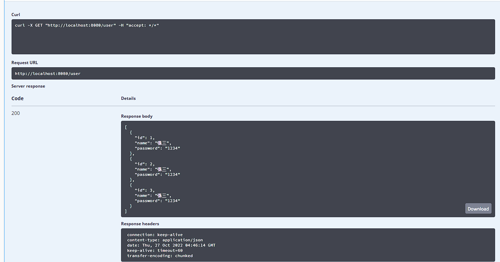
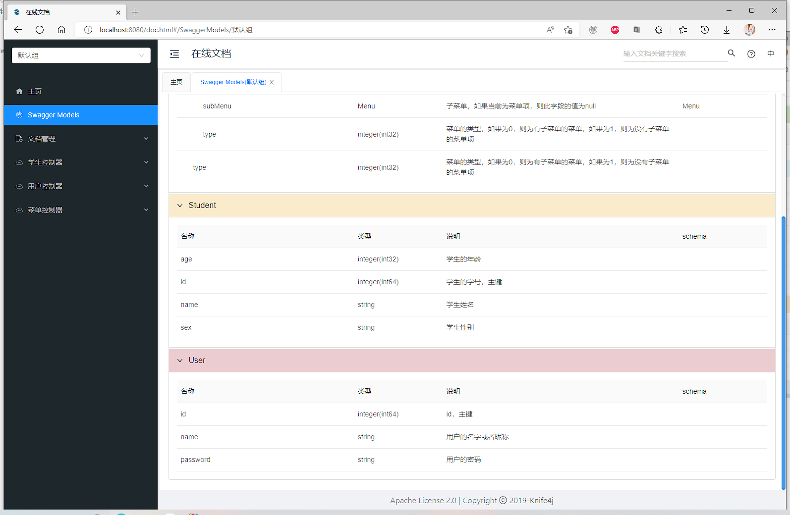
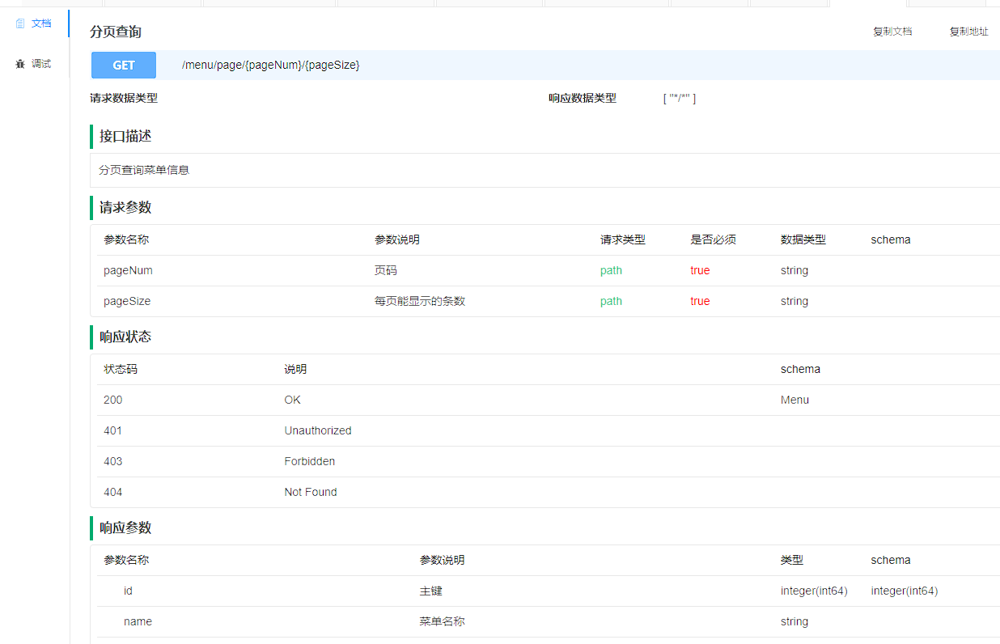
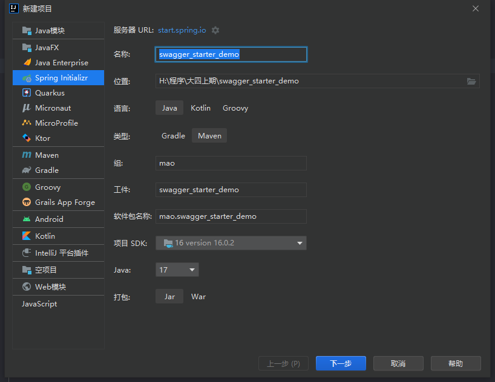
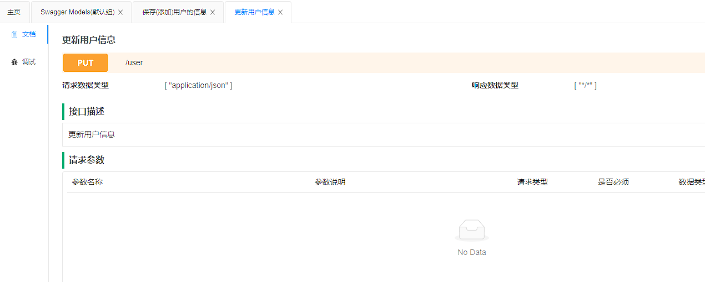

[TOC]

---


# swagger

## 介绍

相信无论是前端还是后端开发，都或多或少地被接口文档折磨过。前端经常抱怨后端给的接口文档与实际情况不一致。后端又觉得编写及维护接口文档会耗费不少精力，经常来不及更新。其实无论是前端调用后端，还是后端调用后端，都期望有一个好的接口文档。但是这个接口文档对于程序员来说，就跟注释一样，经常会抱怨别人写的代码没有写注释，然而自己写起代码起来，最讨厌的，也是写注释。所以仅仅只通过强制来规范大家是不够的，随着时间推移，版本迭代，接口文档往往很容易就跟不上代码了。

使用Swagger你只需要按照它的规范去定义接口及接口相关的信息。再通过Swagger衍生出来的一系列项目和工具，就可以做到生成各种格式的接口文档，生成多种语言的客户端和服务端的代码，以及在线接口调试页面等等。这样，如果按照新的开发模式，在开发新版本或者迭代版本的时候，只需要更新Swagger描述文件，就可以自动生成接口文档和客户端服务端代码，做到调用端代码、服务端代码以及接口文档的一致性。

为了简化swagger的使用，Spring框架对swagger进行了整合，建立了Spring-swagger项目，后面改成了现在的Springfox。通过在项目中引入Springfox，可以扫描相关的代码，生成描述文件，进而生成与代码一致的接口文档和客户端代码。


Springfox对应的maven坐标如下：

```xml
<dependency>
    <groupId>io.springfox</groupId>
    <artifactId>springfox-swagger-ui</artifactId>
    <version>2.9.2</version>
</dependency>
<dependency>
    <groupId>io.springfox</groupId>
    <artifactId>springfox-swagger2</artifactId>
    <version>2.9.2</version>
</dependency>
```


## swagger常用注解


|        注解        |                           说明                           |
| :----------------: | :------------------------------------------------------: |
|        @Api        |      用在请求的类上，例如Controller，表示对类的说明      |
|     @ApiModel      |    用在类上，通常是实体类，表示一个返回响应数据的信息    |
| @ApiModelProperty  |               用在属性上，描述响应类的属性               |
|   @ApiOperation    |          用在请求的方法上，说明方法的用途、作用          |
| @ApiImplicitParams |            用在请求的方法上，表示一组参数说明            |
| @ApiImplicitParam  | 用在@ApiImplicitParams注解中，指定一个请求参数的各个方面 |


## swagger入门案例


### 第一步：创建工程swagger_demo


### 第二步：修改pom文件


```xml
<?xml version="1.0" encoding="UTF-8"?>
<project xmlns="http://maven.apache.org/POM/4.0.0" xmlns:xsi="http://www.w3.org/2001/XMLSchema-instance"
         xsi:schemaLocation="http://maven.apache.org/POM/4.0.0 https://maven.apache.org/xsd/maven-4.0.0.xsd">
    <modelVersion>4.0.0</modelVersion>
    <parent>
        <groupId>org.springframework.boot</groupId>
        <artifactId>spring-boot-starter-parent</artifactId>
        <version>2.7.1</version>
        <relativePath/> <!-- lookup parent from repository -->
    </parent>
    <groupId>mao</groupId>
    <artifactId>swagger_demo</artifactId>
    <version>0.0.1-SNAPSHOT</version>
    <name>swagger_demo</name>
    <description>swagger_demo</description>
    <properties>
        <java.version>11</java.version>
    </properties>
    <dependencies>
        <dependency>
            <groupId>org.springframework.boot</groupId>
            <artifactId>spring-boot-starter-web</artifactId>
        </dependency>

        <dependency>
            <groupId>org.springframework.boot</groupId>
            <artifactId>spring-boot-starter-test</artifactId>
            <scope>test</scope>
        </dependency>

        <dependency>
            <groupId>io.springfox</groupId>
            <artifactId>springfox-swagger-ui</artifactId>
            <version>2.9.2</version>
        </dependency>
        <dependency>
            <groupId>io.springfox</groupId>
            <artifactId>springfox-swagger2</artifactId>
            <version>2.9.2</version>
        </dependency>

    </dependencies>

    <build>
        <plugins>
            <plugin>
                <groupId>org.springframework.boot</groupId>
                <artifactId>spring-boot-maven-plugin</artifactId>
            </plugin>
        </plugins>
    </build>

</project>

```


### 第三步：创建实体类User


```java
package mao.swagger_demo.entity;

/**
 * Project name(项目名称)：swagger_demo
 * Package(包名): mao.swagger_demo.entity
 * Class(类名): User
 * Author(作者）: mao
 * Author QQ：1296193245
 * GitHub：https://github.com/maomao124/
 * Date(创建日期)： 2022/10/26
 * Time(创建时间)： 20:19
 * Version(版本): 1.0
 * Description(描述)： 无
 */


public class User
{
    /**
     * id
     */
    private long id;

    /**
     * 名字
     */
    private String name;

    /**
     * 密码
     */
    private String password;

}
```


### 第四步：给实体类User添加对应的注解


```java
package mao.swagger_demo.entity;

import io.swagger.annotations.ApiModel;
import io.swagger.annotations.ApiModelProperty;

/**
 * Project name(项目名称)：swagger_demo
 * Package(包名): mao.swagger_demo.entity
 * Class(类名): User
 * Author(作者）: mao
 * Author QQ：1296193245
 * GitHub：https://github.com/maomao124/
 * Date(创建日期)： 2022/10/26
 * Time(创建时间)： 20:19
 * Version(版本): 1.0
 * Description(描述)： 无
 */

@ApiModel(description = "用户实体类")
public class User
{
    /**
     * id
     */
    @ApiModelProperty(value = "id，主键")
    private long id;

    /**
     * 名字
     */
    @ApiModelProperty(value = "用户的名字或者昵称")
    private String name;

    /**
     * 密码
     */
    @ApiModelProperty(value = "用户的密码")
    private String password;


    public User()
    {
    }

    public User(long id, String name, String password)
    {
        this.id = id;
        this.name = name;
        this.password = password;
    }

    public long getId()
    {
        return id;
    }

    public void setId(long id)
    {
        this.id = id;
    }

    public String getName()
    {
        return name;
    }

    public void setName(String name)
    {
        this.name = name;
    }

    public String getPassword()
    {
        return password;
    }

    public void setPassword(String password)
    {
        this.password = password;
    }

    @Override
    @SuppressWarnings("all")
    public String toString()
    {
        final StringBuilder stringbuilder = new StringBuilder();
        stringbuilder.append("id：").append(id).append('\n');
        stringbuilder.append("name：").append(name).append('\n');
        stringbuilder.append("password：").append(password).append('\n');
        return stringbuilder.toString();
    }
}
```


### 第五步：创建实体类Menu


```java
package mao.swagger_demo.entity;

/**
 * Project name(项目名称)：swagger_demo
 * Package(包名): mao.swagger_demo.entity
 * Class(类名): Menu
 * Author(作者）: mao
 * Author QQ：1296193245
 * GitHub：https://github.com/maomao124/
 * Date(创建日期)： 2022/10/26
 * Time(创建时间)： 20:34
 * Version(版本): 1.0
 * Description(描述)： 无
 */

public class Menu
{
    /**
     * id
     */
    private long id;

    /**
     * 名字
     */
    private String name;

    /**
     * 类型
     */
    private int type;

    /**
     * 子菜单
     */
    private Menu subMenu;
}
```


### 第六步：给实体类Menu添加对应的注解


```java
package mao.swagger_demo.entity;

import io.swagger.annotations.ApiModel;
import io.swagger.annotations.ApiModelProperty;

/**
 * Project name(项目名称)：swagger_demo
 * Package(包名): mao.swagger_demo.entity
 * Class(类名): Menu
 * Author(作者）: mao
 * Author QQ：1296193245
 * GitHub：https://github.com/maomao124/
 * Date(创建日期)： 2022/10/26
 * Time(创建时间)： 20:34
 * Version(版本): 1.0
 * Description(描述)： 无
 */

@ApiModel(description = "菜单实体类")
public class Menu
{
    /**
     * id
     */
    @ApiModelProperty(value = "主键")
    private long id;

    /**
     * 名字
     */
    @ApiModelProperty(value = "菜单名称")
    private String name;

    /**
     * 类型
     */
    @ApiModelProperty(value = "菜单的类型，如果为0，则为有子菜单的菜单，如果为1，则为没有子菜单的菜单项")
    private int type;

    /**
     * 子菜单
     */
    @ApiModelProperty(value = "子菜单，如果当前为菜单项，则此字段的值为null")
    private Menu subMenu;

    /**
     * Instantiates a new Menu.
     */
    public Menu()
    {
    }

    /**
     * Instantiates a new Menu.
     *
     * @param id      the id
     * @param name    the name
     * @param type    the type
     * @param subMenu the sub menu
     */
    public Menu(long id, String name, int type, Menu subMenu)
    {
        this.id = id;
        this.name = name;
        this.type = type;
        this.subMenu = subMenu;
    }

    /**
     * Gets id.
     *
     * @return the id
     */
    public long getId()
    {
        return id;
    }

    /**
     * Sets id.
     *
     * @param id the id
     */
    public void setId(long id)
    {
        this.id = id;
    }

    /**
     * Gets name.
     *
     * @return the name
     */
    public String getName()
    {
        return name;
    }

    /**
     * Sets name.
     *
     * @param name the name
     */
    public void setName(String name)
    {
        this.name = name;
    }

    /**
     * Gets type.
     *
     * @return the type
     */
    public int getType()
    {
        return type;
    }

    /**
     * Sets type.
     *
     * @param type the type
     */
    public void setType(int type)
    {
        this.type = type;
    }

    /**
     * Gets sub menu.
     *
     * @return the sub menu
     */
    public Menu getSubMenu()
    {
        return subMenu;
    }

    /**
     * Sets sub menu.
     *
     * @param subMenu the sub menu
     */
    public void setSubMenu(Menu subMenu)
    {
        this.subMenu = subMenu;
    }

    @Override
    @SuppressWarnings("all")
    public String toString()
    {
        final StringBuilder stringbuilder = new StringBuilder();
        stringbuilder.append("id：").append(id).append('\n');
        stringbuilder.append("name：").append(name).append('\n');
        stringbuilder.append("type：").append(type).append('\n');
        stringbuilder.append("subMenu：").append(subMenu).append('\n');
        return stringbuilder.toString();
    }
}
```


### 第七步：创建实体类Student


```java
package mao.swagger_demo.entity;

/**
 * Project name(项目名称)：swagger_demo
 * Package(包名): mao.swagger_demo.entity
 * Class(类名): Student
 * Author(作者）: mao
 * Author QQ：1296193245
 * GitHub：https://github.com/maomao124/
 * Date(创建日期)： 2022/10/26
 * Time(创建时间)： 20:41
 * Version(版本): 1.0
 * Description(描述)： 无
 */

public class Student
{
    /**
     * id
     */
    private long id;
    /**
     * 名字
     */
    private String name;
    /**
     * 性
     */
    private String sex;
    /**
     * 年龄
     */
    private int age;
}
```


### 第八步：给实体类Student添加对应的注解


```java
package mao.swagger_demo.entity;

import io.swagger.annotations.ApiModel;
import io.swagger.annotations.ApiModelProperty;

/**
 * Project name(项目名称)：swagger_demo
 * Package(包名): mao.swagger_demo.entity
 * Class(类名): Student
 * Author(作者）: mao
 * Author QQ：1296193245
 * GitHub：https://github.com/maomao124/
 * Date(创建日期)： 2022/10/26
 * Time(创建时间)： 20:41
 * Version(版本): 1.0
 * Description(描述)： 无
 */


@ApiModel(description = "学生实体类")
public class Student
{
    /**
     * id
     */
    @ApiModelProperty(value = "学生的学号，主键")
    private long id;
    /**
     * 名字
     */
    @ApiModelProperty(value = "学生姓名")
    private String name;
    /**
     * 性
     */
    @ApiModelProperty(value = "学生性别")
    private String sex;
    /**
     * 年龄
     */
    @ApiModelProperty(value = "学生的年龄")
    private int age;

    /**
     * Instantiates a new Student.
     */
    public Student()
    {
    }

    /**
     * Instantiates a new Student.
     *
     * @param id   the id
     * @param name the name
     * @param sex  the sex
     * @param age  the age
     */
    public Student(long id, String name, String sex, int age)
    {
        this.id = id;
        this.name = name;
        this.sex = sex;
        this.age = age;
    }

    /**
     * Gets id.
     *
     * @return the id
     */
    public long getId()
    {
        return id;
    }

    /**
     * Sets id.
     *
     * @param id the id
     */
    public void setId(long id)
    {
        this.id = id;
    }

    /**
     * Gets name.
     *
     * @return the name
     */
    public String getName()
    {
        return name;
    }

    /**
     * Sets name.
     *
     * @param name the name
     */
    public void setName(String name)
    {
        this.name = name;
    }

    /**
     * Gets sex.
     *
     * @return the sex
     */
    public String getSex()
    {
        return sex;
    }

    /**
     * Sets sex.
     *
     * @param sex the sex
     */
    public void setSex(String sex)
    {
        this.sex = sex;
    }

    /**
     * Gets age.
     *
     * @return the age
     */
    public int getAge()
    {
        return age;
    }

    /**
     * Sets age.
     *
     * @param age the age
     */
    public void setAge(int age)
    {
        this.age = age;
    }

    @Override
    @SuppressWarnings("all")
    public String toString()
    {
        final StringBuilder stringbuilder = new StringBuilder();
        stringbuilder.append("id：").append(id).append('\n');
        stringbuilder.append("name：").append(name).append('\n');
        stringbuilder.append("sex：").append(sex).append('\n');
        stringbuilder.append("age：").append(age).append('\n');
        return stringbuilder.toString();
    }
}
```


### 第九步：创建UserController


```java
package mao.swagger_demo.controller;

import mao.swagger_demo.entity.User;
import org.springframework.web.bind.annotation.*;

import java.util.ArrayList;
import java.util.List;

/**
 * Project name(项目名称)：swagger_demo
 * Package(包名): mao.swagger_demo.controller
 * Class(类名): UserController
 * Author(作者）: mao
 * Author QQ：1296193245
 * GitHub：https://github.com/maomao124/
 * Date(创建日期)： 2022/10/26
 * Time(创建时间)： 20:45
 * Version(版本): 1.0
 * Description(描述)： 无
 */

@RestController
@RequestMapping("/user")
public class UserController
{
    @GetMapping("/{id}")
    public User getUser(@PathVariable long id)
    {
        return new User(id, "张三", "1234");
    }

    @GetMapping
    public List<User> getAll()
    {
        List<User> list = new ArrayList<>(3);
        list.add(new User(1, "张三", "1234"));
        list.add(new User(2, "张三", "1234"));
        list.add(new User(3, "张三", "1234"));
        return list;
    }

    @PostMapping("")
    public String saveUser()
    {
        return "ok";
    }

    @PutMapping
    public String updateUser()
    {
        return "ok";
    }

    @DeleteMapping
    public String deleteUser()
    {
        return "ok";
    }
}
```


### 第十步：给UserController添加对应的注解


```java
package mao.swagger_demo.controller;

import io.swagger.annotations.Api;
import io.swagger.annotations.ApiImplicitParam;
import io.swagger.annotations.ApiImplicitParams;
import io.swagger.annotations.ApiOperation;
import mao.swagger_demo.entity.User;
import org.springframework.web.bind.annotation.*;

import java.util.ArrayList;
import java.util.List;

/**
 * Project name(项目名称)：swagger_demo
 * Package(包名): mao.swagger_demo.controller
 * Class(类名): UserController
 * Author(作者）: mao
 * Author QQ：1296193245
 * GitHub：https://github.com/maomao124/
 * Date(创建日期)： 2022/10/26
 * Time(创建时间)： 20:45
 * Version(版本): 1.0
 * Description(描述)： 无
 */

@Api(tags = "用户控制器")
@RestController
@RequestMapping("/user")
public class UserController
{
    @GetMapping("/{id}")
    @ApiOperation(value = "根据用户id查询用户", notes = "根据用户id查询用户")
    @ApiImplicitParams
            (
                    @ApiImplicitParam(name = "id", value = "用户的id", required = true, type = "long")
            )
    public User getUser(@PathVariable long id)
    {
        return new User(id, "张三", "1234");
    }

    @GetMapping
    @ApiOperation(value = "查询所有用户", notes = "查询所有用户的信息")
    public List<User> getAll()
    {
        List<User> list = new ArrayList<>(3);
        list.add(new User(1, "张三", "1234"));
        list.add(new User(2, "张三", "1234"));
        list.add(new User(3, "张三", "1234"));
        return list;
    }

    @PostMapping("")
    @ApiOperation(value = "保存(添加)用户的信息", notes = "保存(添加)用户的信息")
    public String saveUser()
    {
        return "ok";
    }

    @PutMapping
    @ApiOperation(value = "更新用户信息", notes = "更新用户信息")
    public String updateUser()
    {
        return "ok";
    }

    @DeleteMapping
    @ApiOperation(value = "删除用户的信息", notes = "删除用户的信息")
    public String deleteUser()
    {
        return "ok";
    }
}
```


### 第十一步：创建MenuController


```java
package mao.swagger_demo.controller;

import org.springframework.web.bind.annotation.*;

/**
 * Project name(项目名称)：swagger_demo
 * Package(包名): mao.swagger_demo.controller
 * Class(类名): MenuController
 * Author(作者）: mao
 * Author QQ：1296193245
 * GitHub：https://github.com/maomao124/
 * Date(创建日期)： 2022/10/26
 * Time(创建时间)： 21:02
 * Version(版本): 1.0
 * Description(描述)： 无
 */


public class MenuController
{
    @PostMapping("/save")
    public String save()
    {
        return "OK";
    }

    @PutMapping("/update")
    public String update()
    {
        return "OK";
    }

    @DeleteMapping("/delete")
    public String delete(int id)
    {
        return "OK";
    }


    @GetMapping(value = "page/{pageNum}/{pageSize}")
    public List<Menu> findByPage(@PathVariable Integer pageNum,
                             @PathVariable Integer pageSize)
    {
        return null;
    }
}
```


### 第十二步：给MenuController添加相应的注解


```java
package mao.swagger_demo.controller;

import io.swagger.annotations.Api;
import io.swagger.annotations.ApiImplicitParam;
import io.swagger.annotations.ApiImplicitParams;
import io.swagger.annotations.ApiOperation;
import org.springframework.web.bind.annotation.*;

/**
 * Project name(项目名称)：swagger_demo
 * Package(包名): mao.swagger_demo.controller
 * Class(类名): MenuController
 * Author(作者）: mao
 * Author QQ：1296193245
 * GitHub：https://github.com/maomao124/
 * Date(创建日期)： 2022/10/26
 * Time(创建时间)： 21:02
 * Version(版本): 1.0
 * Description(描述)： 无
 */


@RestController()
@RequestMapping("/menu")
@Api(tags = "菜单控制器")
public class MenuController
{
    @PostMapping("/save")
    @ApiOperation(value = "添加菜单", notes = "添加菜单")
    public String save()
    {
        return "OK";
    }

    @PutMapping("/update")
    @ApiOperation(value = "更新菜单", notes = "更新菜单")
    public String update()
    {
        return "OK";
    }

    @DeleteMapping("/delete")
    @ApiOperation(value = "删除菜单", notes = "删除菜单")
    @ApiImplicitParams
            (
                    @ApiImplicitParam(name = "id", value = "菜单的id", required = true, type = "long")
            )
    public String delete(long id)
    {
        return "OK";
    }


    @GetMapping(value = "page/{pageNum}/{pageSize}")
    @ApiOperation(value = "分页查询", notes = "分页查询菜单信息")
    @ApiImplicitParams
            (
                    {
                            @ApiImplicitParam(name = "pageNum", value = "页码", required = true, type = "Integer"),
                            @ApiImplicitParam(name = "pageSize", value = "每页能显示的条数", required = true, type = "Integer")
                    }
            )
    public List<Menu> findByPage(@PathVariable Integer pageNum,
                             @PathVariable Integer pageSize)
    {
        return null;
    }
}

```


### 第十三步：创建StudentController


```java
package mao.swagger_demo.controller;

import org.springframework.web.bind.annotation.GetMapping;
import org.springframework.web.bind.annotation.PathVariable;
import org.springframework.web.bind.annotation.RequestMapping;
import org.springframework.web.bind.annotation.RestController;

/**
 * Project name(项目名称)：swagger_demo
 * Package(包名): mao.swagger_demo.controller
 * Class(类名): StudentController
 * Author(作者）: mao
 * Author QQ：1296193245
 * GitHub：https://github.com/maomao124/
 * Date(创建日期)： 2022/10/26
 * Time(创建时间)： 21:12
 * Version(版本): 1.0
 * Description(描述)： 无
 */

@RestController
@RequestMapping("/student")
public class StudentController
{
    @GetMapping("/{pageNum}/{pageSize}")
    public List<Student> findByPage(@PathVariable Integer pageNum,
                             @PathVariable Integer pageSize)
    {
        return null;
    }
}
```


### 第十四步：给StudentController添加相应的注解


```java
package mao.swagger_demo.controller;

import io.swagger.annotations.Api;
import io.swagger.annotations.ApiImplicitParam;
import io.swagger.annotations.ApiImplicitParams;
import io.swagger.annotations.ApiOperation;
import org.springframework.web.bind.annotation.GetMapping;
import org.springframework.web.bind.annotation.PathVariable;
import org.springframework.web.bind.annotation.RequestMapping;
import org.springframework.web.bind.annotation.RestController;

/**
 * Project name(项目名称)：swagger_demo
 * Package(包名): mao.swagger_demo.controller
 * Class(类名): StudentController
 * Author(作者）: mao
 * Author QQ：1296193245
 * GitHub：https://github.com/maomao124/
 * Date(创建日期)： 2022/10/26
 * Time(创建时间)： 21:12
 * Version(版本): 1.0
 * Description(描述)： 无
 */

@RestController
@RequestMapping("/student")
@Api(tags = "学生控制器")
public class StudentController
{
    @GetMapping("/{pageNum}/{pageSize}")
    @ApiOperation(value = "分页查询学生的信息", notes = "分页查询学生的信息")
    @ApiImplicitParams
            (
                    {
                            @ApiImplicitParam(name = "pageNum", value = "页码", required = true, type = "Integer"),
                            @ApiImplicitParam(name = "pageSize", value = "每页能显示的条数", required = true, type = "Integer")
                    }
            )
    public List<Student> findByPage(@PathVariable Integer pageNum,
                             @PathVariable Integer pageSize)
    {
        return null;
    }
}
```


### 第十五步：添加配置类SwaggerConfig


```java
package mao.swagger_demo.config;


import org.springframework.context.annotation.Bean;
import org.springframework.context.annotation.Configuration;

import springfox.documentation.builders.ApiInfoBuilder;
import springfox.documentation.builders.RequestHandlerSelectors;
import springfox.documentation.service.ApiInfo;
import springfox.documentation.service.Contact;
import springfox.documentation.spi.DocumentationType;
import springfox.documentation.spring.web.plugins.Docket;

import springfox.documentation.swagger2.annotations.EnableSwagger2;


/**
 * Project name(项目名称)：swagger_demo
 * Package(包名): mao.swagger_demo.config
 * Class(类名): SwaggerConfig
 * Author(作者）: mao
 * Author QQ：1296193245
 * GitHub：https://github.com/maomao124/
 * Date(创建日期)： 2022/10/26
 * Time(创建时间)： 21:19
 * Version(版本): 1.0
 * Description(描述)： 无
 */

@Configuration
@EnableSwagger2
public class SwaggerConfig
{
    private ApiInfo apiInfo()
    {
        return new ApiInfoBuilder()
                .title("API接口文档")
                .contact(new Contact("mao", "https://github.com/maomao124/", "1234@qq.com"))
                .version("1.0")
                .description("描述")
                .build();
    }

    @Bean
    public Docket docket()
    {
        Docket docket = new Docket(DocumentationType.SWAGGER_2)
                .apiInfo(apiInfo())
                .groupName("默认组")
                .select()
                .apis(RequestHandlerSelectors.basePackage("mao.swagger_demo"))
                .build();
        return docket;
    }
}

```


### 第十六步：更改配置文件


```yaml
spring:
  mvc:
    pathmatch:
      matching-strategy: ant_path_matcher
```


### 第十七步：启动程序


```sh

  .   ____          _            __ _ _
 /\\ / ___'_ __ _ _(_)_ __  __ _ \ \ \ \
( ( )\___ | '_ | '_| | '_ \/ _` | \ \ \ \
 \\/  ___)| |_)| | | | | || (_| |  ) ) ) )
  '  |____| .__|_| |_|_| |_\__, | / / / /
 =========|_|==============|___/=/_/_/_/
 :: Spring Boot ::                (v2.7.1)

2022-10-27 12:43:12.425  INFO 15432 --- [           main] mao.swagger_demo.SwaggerDemoApplication  : Starting SwaggerDemoApplication using Java 16.0.2 on mao with PID 15432 (H:\程序\大四上期\swagger_demo\target\classes started by mao in H:\程序\大四上期\swagger_demo)
2022-10-27 12:43:12.427  INFO 15432 --- [           main] mao.swagger_demo.SwaggerDemoApplication  : No active profile set, falling back to 1 default profile: "default"
2022-10-27 12:43:13.257  INFO 15432 --- [           main] o.s.b.w.embedded.tomcat.TomcatWebServer  : Tomcat initialized with port(s): 8080 (http)
2022-10-27 12:43:13.264  INFO 15432 --- [           main] o.apache.catalina.core.StandardService   : Starting service [Tomcat]
2022-10-27 12:43:13.265  INFO 15432 --- [           main] org.apache.catalina.core.StandardEngine  : Starting Servlet engine: [Apache Tomcat/9.0.64]
2022-10-27 12:43:13.350  INFO 15432 --- [           main] o.a.c.c.C.[Tomcat].[localhost].[/]       : Initializing Spring embedded WebApplicationContext
2022-10-27 12:43:13.350  INFO 15432 --- [           main] w.s.c.ServletWebServerApplicationContext : Root WebApplicationContext: initialization completed in 883 ms
2022-10-27 12:43:13.604  INFO 15432 --- [           main] pertySourcedRequestMappingHandlerMapping : Mapped URL path [/v2/api-docs] onto method [springfox.documentation.swagger2.web.Swagger2Controller#getDocumentation(String, HttpServletRequest)]
2022-10-27 12:43:13.753  INFO 15432 --- [           main] o.s.b.w.embedded.tomcat.TomcatWebServer  : Tomcat started on port(s): 8080 (http) with context path ''
2022-10-27 12:43:13.754  INFO 15432 --- [           main] d.s.w.p.DocumentationPluginsBootstrapper : Context refreshed
2022-10-27 12:43:13.765  INFO 15432 --- [           main] d.s.w.p.DocumentationPluginsBootstrapper : Found 1 custom documentation plugin(s)
2022-10-27 12:43:13.786  INFO 15432 --- [           main] s.d.s.w.s.ApiListingReferenceScanner     : Scanning for api listing references
2022-10-27 12:43:13.882  INFO 15432 --- [           main] .d.s.w.r.o.CachingOperationNameGenerator : Generating unique operation named: findByPageUsingGET_1
2022-10-27 12:43:13.914  INFO 15432 --- [           main] mao.swagger_demo.SwaggerDemoApplication  : Started SwaggerDemoApplication in 1.787 seconds (JVM running for 2.316)
```


### 第十八步：访问


http://localhost:8080/swagger-ui.html





## knife4j介绍

knife4j是为Java MVC框架集成Swagger生成Api文档的增强解决方案,前身是swagger-bootstrap-ui,取名knife4j是希望它能像一把匕首一样小巧,轻量,并且功能强悍!其底层是对Springfox的封装，使用方式也和Springfox一致，只是对接口文档UI进行了优化。


**核心功能**：

- **文档说明**：根据Swagger的规范说明，详细列出接口文档的说明，包括接口地址、类型、请求示例、请求参数、响应示例、响应参数、响应码等信息，对该接口的使用情况一目了然。
- **在线调试**：提供在线接口联调的强大功能，自动解析当前接口参数,同时包含表单验证，调用参数可返回接口响应内容、headers、响应时间、响应状态码等信息，帮助开发者在线调试。


## knife4j入门案例


### 第一步：创建工程swagger_knife4j_demo


### 第二步：修改pom文件


```xml
<?xml version="1.0" encoding="UTF-8"?>
<project xmlns="http://maven.apache.org/POM/4.0.0" xmlns:xsi="http://www.w3.org/2001/XMLSchema-instance"
         xsi:schemaLocation="http://maven.apache.org/POM/4.0.0 https://maven.apache.org/xsd/maven-4.0.0.xsd">
    <modelVersion>4.0.0</modelVersion>
    <parent>
        <groupId>org.springframework.boot</groupId>
        <artifactId>spring-boot-starter-parent</artifactId>
<!--        <version>2.2.12.RELEASE</version>-->
        <version>2.7.1</version>
        <relativePath/> <!-- lookup parent from repository -->
    </parent>
    <groupId>mao</groupId>
    <artifactId>swagger_knife4j_demo</artifactId>
    <version>0.0.1-SNAPSHOT</version>
    <name>swagger_knife4j_demo</name>
    <description>swagger_knife4j_demo</description>
    <properties>
        <java.version>11</java.version>
    </properties>
    <dependencies>
        <dependency>
            <groupId>org.springframework.boot</groupId>
            <artifactId>spring-boot-starter-web</artifactId>
        </dependency>

        <dependency>
            <groupId>org.springframework.boot</groupId>
            <artifactId>spring-boot-starter-test</artifactId>
            <scope>test</scope>
        </dependency>

        <dependency>
            <groupId>com.github.xiaoymin</groupId>
            <artifactId>knife4j-spring-boot-starter</artifactId>
            <version>2.0.1</version>
        </dependency>

    </dependencies>

    <build>
        <plugins>
            <plugin>
                <groupId>org.springframework.boot</groupId>
                <artifactId>spring-boot-maven-plugin</artifactId>
            </plugin>
        </plugins>
    </build>

</project>

```


### 第三步：拷贝之前的entity包和controller包到此项目里


### 第四步：创建配置属性类SwaggerConfigurationProperties


```java
package mao.swagger_knife4j_demo.config;


import org.springframework.boot.context.properties.ConfigurationProperties;
import org.springframework.stereotype.Component;

import java.util.ArrayList;
import java.util.LinkedHashMap;
import java.util.List;
import java.util.Map;

/**
 * Project name(项目名称)：swagger_knife4j_demo
 * Package(包名): mao.swagger_knife4j_demo.config
 * Class(类名): SwaggerConfigurationProperties
 * Author(作者）: mao
 * Author QQ：1296193245
 * GitHub：https://github.com/maomao124/
 * Date(创建日期)： 2022/10/27
 * Time(创建时间)： 13:16
 * Version(版本): 1.0
 * Description(描述)： 无
 */

@Component("swaggerConfigurationProperties")
@ConfigurationProperties(prefix = "swagger")
public class SwaggerConfigurationProperties
{
    /**
     * 标题
     */
    private String title = "在线文档";

    /**
     * 自定义组名
     */
    private String group = "";

    /**
     * 描述
     */
    private String description = "在线文档";

    /**
     * 版本
     */
    private String version = "1.0";

    /**
     * 联系人
     */
    private Contact contact = new Contact();

    /**
     * swagger会解析的包路径
     */
    private String basePackage = "";

    /**
     * swagger会解析的url规则
     */
    private List<String> basePath = new ArrayList<>();

    /**
     * 在basePath基础上需要排除的url规则
     */
    private List<String> excludePath = new ArrayList<>();

    /**
     * 分组文档
     */
    private Map<String, DocketInfo> docket = new LinkedHashMap<>();


    public SwaggerConfigurationProperties()
    {

    }

    /**
     * 构造方法
     *
     * @param title       标题
     * @param group       组
     * @param description 描述
     * @param version     版本
     * @param contact     联系
     * @param basePackage 基本包
     * @param basePath    基本路径
     * @param excludePath 排除路径
     * @param docket      摘要
     */
    public SwaggerConfigurationProperties(String title, String group, String description, 
                                          String version, Contact contact, String basePackage, 
                                          List<String> basePath, List<String> excludePath, 
                                          Map<String, DocketInfo> docket)
    {
        this.title = title;
        this.group = group;
        this.description = description;
        this.version = version;
        this.contact = contact;
        this.basePackage = basePackage;
        this.basePath = basePath;
        this.excludePath = excludePath;
        this.docket = docket;
    }

    /**
     * 获得组
     *
     * @return {@link String}
     */
    public String getGroup()
    {
        if (group == null || "".equals(group))
        {
            return title;
        }
        return group;
    }


    /**
     * 获得标题
     *
     * @return {@link String}
     */
    public String getTitle()
    {
        return title;
    }

    /**
     * 设置标题
     *
     * @param title 标题
     */
    public void setTitle(String title)
    {
        this.title = title;
    }

    /**
     * 设置组
     *
     * @param group 组
     */
    public void setGroup(String group)
    {
        this.group = group;
    }

    /**
     * 得到描述
     *
     * @return {@link String}
     */
    public String getDescription()
    {
        return description;
    }

    /**
     * 设置描述
     *
     * @param description 描述
     */
    public void setDescription(String description)
    {
        this.description = description;
    }

    /**
     * 获得版本
     *
     * @return {@link String}
     */
    public String getVersion()
    {
        return version;
    }

    /**
     * 设置版本
     *
     * @param version 版本
     */
    public void setVersion(String version)
    {
        this.version = version;
    }

    /**
     * 得到联系
     *
     * @return {@link Contact}
     */
    public Contact getContact()
    {
        return contact;
    }

    /**
     * 建立联系
     *
     * @param contact 联系
     */
    public void setContact(Contact contact)
    {
        this.contact = contact;
    }

    /**
     * 获得基础包
     *
     * @return {@link String}
     */
    public String getBasePackage()
    {
        return basePackage;
    }

    /**
     * 设置基础包
     *
     * @param basePackage 基本包
     */
    public void setBasePackage(String basePackage)
    {
        this.basePackage = basePackage;
    }

    /**
     * 得到基本路径
     *
     * @return {@link List}<{@link String}>
     */
    public List<String> getBasePath()
    {
        return basePath;
    }

    /**
     * 设置基本路径
     *
     * @param basePath 基本路径
     */
    public void setBasePath(List<String> basePath)
    {
        this.basePath = basePath;
    }

    /**
     * 得到排除路径
     *
     * @return {@link List}<{@link String}>
     */
    public List<String> getExcludePath()
    {
        return excludePath;
    }

    /**
     * 设置排除路径
     *
     * @param excludePath 排除路径
     */
    public void setExcludePath(List<String> excludePath)
    {
        this.excludePath = excludePath;
    }

    /**
     * 得到摘要
     *
     * @return {@link Map}<{@link String}, {@link DocketInfo}>
     */
    public Map<String, DocketInfo> getDocket()
    {
        return docket;
    }

    /**
     * 设置摘要
     *
     * @param docket 摘要
     */
    public void setDocket(Map<String, DocketInfo> docket)
    {
        this.docket = docket;
    }

    public static class DocketInfo
    {
        /**
         * 标题
         */
        private String title = "在线文档";

        /**
         * 自定义组名
         */
        private String group = "";

        /**
         * 描述
         */
        private String description = "在线文档";

        /**
         * 版本
         */
        private String version = "1.0";

        /**
         * 联系人
         */
        private Contact contact = new Contact();

        /**
         * swagger会解析的包路径
         */
        private String basePackage = "";

        /**
         * swagger会解析的url规则
         */
        private List<String> basePath = new ArrayList<>();

        /**
         * 在basePath基础上需要排除的url
         */
        private List<String> excludePath = new ArrayList<>();


        public DocketInfo()
        {

        }

        /**
         * 构造方法
         *
         * @param title       标题
         * @param group       组
         * @param description 描述
         * @param version     版本
         * @param contact     联系
         * @param basePackage 基本包
         * @param basePath    基本路径
         * @param excludePath 排除路径
         */
        public DocketInfo(String title, String group, String description,
                          String version, Contact contact, String basePackage, 
                          List<String> basePath, List<String> excludePath)
        {
            this.title = title;
            this.group = group;
            this.description = description;
            this.version = version;
            this.contact = contact;
            this.basePackage = basePackage;
            this.basePath = basePath;
            this.excludePath = excludePath;
        }

        /**
         * 获得组
         *
         * @return {@link String}
         */
        public String getGroup()
        {
            if (group == null || "".equals(group))
            {
                return title;
            }
            return group;
        }

        /**
         * 获得标题
         *
         * @return {@link String}
         */
        public String getTitle()
        {
            return title;
        }

        /**
         * 设置标题
         *
         * @param title 标题
         */
        public void setTitle(String title)
        {
            this.title = title;
        }

        /**
         * 设置组
         *
         * @param group 组
         */
        public void setGroup(String group)
        {
            this.group = group;
        }

        /**
         * 得到描述
         *
         * @return {@link String}
         */
        public String getDescription()
        {
            return description;
        }

        /**
         * 设置描述
         *
         * @param description 描述
         */
        public void setDescription(String description)
        {
            this.description = description;
        }

        /**
         * 获得版本
         *
         * @return {@link String}
         */
        public String getVersion()
        {
            return version;
        }

        /**
         * 设置版本
         *
         * @param version 版本
         */
        public void setVersion(String version)
        {
            this.version = version;
        }

        /**
         * 得到联系
         *
         * @return {@link Contact}
         */
        public Contact getContact()
        {
            return contact;
        }

        /**
         * 建立联系
         *
         * @param contact 联系
         */
        public void setContact(Contact contact)
        {
            this.contact = contact;
        }

        /**
         * 获得基础包
         *
         * @return {@link String}
         */
        public String getBasePackage()
        {
            return basePackage;
        }

        /**
         * 设置基础包
         *
         * @param basePackage 基本包
         */
        public void setBasePackage(String basePackage)
        {
            this.basePackage = basePackage;
        }

        /**
         * 得到基本路径
         *
         * @return {@link List}<{@link String}>
         */
        public List<String> getBasePath()
        {
            return basePath;
        }

        /**
         * 设置基本路径
         *
         * @param basePath 基本路径
         */
        public void setBasePath(List<String> basePath)
        {
            this.basePath = basePath;
        }

        /**
         * 得到排除路径
         *
         * @return {@link List}<{@link String}>
         */
        public List<String> getExcludePath()
        {
            return excludePath;
        }

        /**
         * 设置排除路径
         *
         * @param excludePath 排除路径
         */
        public void setExcludePath(List<String> excludePath)
        {
            this.excludePath = excludePath;
        }
    }

    public static class Contact
    {
        /**
         * 联系人名称
         */
        private String name = "";

        /**
         * url
         */
        private String url = "";

        /**
         * 电子邮件
         */
        private String email = "";


        public Contact()
        {

        }

        /**
         * 构造方法
         *
         * @param name  名字
         * @param url   url
         * @param email 电子邮件
         */
        public Contact(String name, String url, String email)
        {
            this.name = name;
            this.url = url;
            this.email = email;
        }

        /**
         * 得到名字
         *
         * @return {@link String}
         */
        public String getName()
        {
            return name;
        }

        /**
         * 设置名字
         *
         * @param name 名字
         */
        public void setName(String name)
        {
            this.name = name;
        }

        /**
         * 获取url
         *
         * @return {@link String}
         */
        public String getUrl()
        {
            return url;
        }

        /**
         * 设置url
         *
         * @param url url
         */
        public void setUrl(String url)
        {
            this.url = url;
        }

        /**
         * 获得电子邮件
         *
         * @return {@link String}
         */
        public String getEmail()
        {
            return email;
        }

        /**
         * 设置电子邮件
         *
         * @param email 电子邮件
         */
        public void setEmail(String email)
        {
            this.email = email;
        }
    }


    @Override
    public boolean equals(Object o)
    {
        if (this == o)
        {
            return true;
        }
        if (o == null || getClass() != o.getClass())
        {
            return false;
        }

        SwaggerConfigurationProperties that = (SwaggerConfigurationProperties) o;

        if (getTitle() != null ? !getTitle().equals(that.getTitle()) : that.getTitle() != null)
        {
            return false;
        }
        if (getGroup() != null ? !getGroup().equals(that.getGroup()) : that.getGroup() != null)
        {
            return false;
        }
        if (getDescription() != null ? !getDescription().equals(that.getDescription()) : that.getDescription() != null)
        {
            return false;
        }
        if (getVersion() != null ? !getVersion().equals(that.getVersion()) : that.getVersion() != null)
        {
            return false;
        }
        if (getContact() != null ? !getContact().equals(that.getContact()) : that.getContact() != null)
        {
            return false;
        }
        if (getBasePackage() != null ? !getBasePackage().equals(that.getBasePackage()) : that.getBasePackage() != null)
        {
            return false;
        }
        if (getBasePath() != null ? !getBasePath().equals(that.getBasePath()) : that.getBasePath() != null)
        {
            return false;
        }
        if (getExcludePath() != null ? !getExcludePath().equals(that.getExcludePath()) : that.getExcludePath() != null)
        {
            return false;
        }
        return getDocket() != null ? getDocket().equals(that.getDocket()) : that.getDocket() == null;
    }

    @Override
    public int hashCode()
    {
        int result = getTitle() != null ? getTitle().hashCode() : 0;
        result = 31 * result + (getGroup() != null ? getGroup().hashCode() : 0);
        result = 31 * result + (getDescription() != null ? getDescription().hashCode() : 0);
        result = 31 * result + (getVersion() != null ? getVersion().hashCode() : 0);
        result = 31 * result + (getContact() != null ? getContact().hashCode() : 0);
        result = 31 * result + (getBasePackage() != null ? getBasePackage().hashCode() : 0);
        result = 31 * result + (getBasePath() != null ? getBasePath().hashCode() : 0);
        result = 31 * result + (getExcludePath() != null ? getExcludePath().hashCode() : 0);
        result = 31 * result + (getDocket() != null ? getDocket().hashCode() : 0);
        return result;
    }

    @Override
    @SuppressWarnings("all")
    public String toString()
    {
        final StringBuilder stringbuilder = new StringBuilder();
        stringbuilder.append("title：").append(title).append('\n');
        stringbuilder.append("group：").append(group).append('\n');
        stringbuilder.append("description：").append(description).append('\n');
        stringbuilder.append("version：").append(version).append('\n');
        stringbuilder.append("contact：").append(contact).append('\n');
        stringbuilder.append("basePackage：").append(basePackage).append('\n');
        stringbuilder.append("basePath：").append(basePath).append('\n');
        stringbuilder.append("excludePath：").append(excludePath).append('\n');
        stringbuilder.append("docket：").append(docket).append('\n');
        return stringbuilder.toString();
    }
}
```


### 第五步：修改application.yml文件


```yaml
swagger:
  # 是否启用swagger
  enabled: true
  title: 在线文档
  group: 默认组
  version: 1.0
  contact:
    name: mao
    url: https://github.com/maomao124/
    email: 1234@qq.com
  base-package: mao.swagger_knife4j_demo
  # 分组文档
#  docket:
#    user:
#      title: 用户模块
#      base-package:
#    menu:
#      title: 菜单模块
#      base-package:


spring:
  mvc:
    pathmatch:
      matching-strategy: ant_path_matcher
```


### 第六步：创建配置类SwaggerConfig


```java
package mao.swagger_knife4j_demo.config;

import com.google.common.base.Predicate;
import com.google.common.base.Predicates;
import org.slf4j.Logger;
import org.slf4j.LoggerFactory;
import org.springframework.beans.BeansException;
import org.springframework.beans.factory.BeanFactory;
import org.springframework.beans.factory.BeanFactoryAware;
import org.springframework.beans.factory.annotation.Autowired;
import org.springframework.beans.factory.config.ConfigurableBeanFactory;
import org.springframework.boot.autoconfigure.condition.ConditionalOnMissingBean;
import org.springframework.boot.autoconfigure.condition.ConditionalOnProperty;
import org.springframework.boot.context.properties.EnableConfigurationProperties;
import org.springframework.context.annotation.Bean;
import org.springframework.context.annotation.Configuration;
import org.springframework.context.annotation.Import;
import springfox.documentation.builders.ApiInfoBuilder;
import springfox.documentation.builders.PathSelectors;
import springfox.documentation.builders.RequestHandlerSelectors;
import springfox.documentation.service.ApiInfo;
import springfox.documentation.service.Contact;
import springfox.documentation.spi.DocumentationType;
import springfox.documentation.spring.web.plugins.Docket;
import springfox.documentation.swagger2.annotations.EnableSwagger2;

import javax.annotation.PostConstruct;
import java.util.ArrayList;
import java.util.LinkedList;
import java.util.List;

/**
 * Project name(项目名称)：swagger_knife4j_demo
 * Package(包名): mao.swagger_knife4j_demo.config
 * Class(类名): SwaggerConfig
 * Author(作者）: mao
 * Author QQ：1296193245
 * GitHub：https://github.com/maomao124/
 * Date(创建日期)： 2022/10/27
 * Time(创建时间)： 13:40
 * Version(版本): 1.0
 * Description(描述)： 无
 */

@Configuration
@EnableSwagger2
@ConditionalOnProperty(name = "swagger.enabled", havingValue = "true", matchIfMissing = true)
@EnableConfigurationProperties
@Import(SwaggerConfigurationProperties.class)
public class SwaggerConfig implements BeanFactoryAware
{

    /*

    配置文件示例：

swagger:
  # 是否启用swagger
  enabled: true
  title: 在线文档
  group: 默认组
  version: 1.0
  contact:
    name: mao
    url: https://github.com/maomao124/
    email: 1234@qq.com
  base-package: mao.swagger_knife4j_demo
  # 分组文档
#  docket:
#    user:
#      title: 用户模块
#      base-package:
#    menu:
#      title: 菜单模块
#      base-package:


spring:
  mvc:
    pathmatch:
      matching-strategy: ant_path_matcher


http://localhost:8080/swagger-ui.html
http://localhost:8080/doc.html
     */


    @Autowired
    private SwaggerConfigurationProperties swaggerConfigurationProperties;

    private static final Logger log = LoggerFactory.getLogger(SwaggerConfig.class);

    /**
     * bean工厂
     */
    private BeanFactory beanFactory;

    @Override
    public void setBeanFactory(BeanFactory beanFactory) throws BeansException
    {
        this.beanFactory = beanFactory;
    }


    @Bean
    @ConditionalOnMissingBean
    @SuppressWarnings("all")
    public List<Docket> createRestApi()
    {
        ConfigurableBeanFactory configurableBeanFactory =
                (ConfigurableBeanFactory) beanFactory;
        List<Docket> docketList = new LinkedList<>();
        // 没有分组的情况
        if (swaggerConfigurationProperties.getDocket().isEmpty())
        {
            Docket docket = createDocket(swaggerConfigurationProperties);
            configurableBeanFactory.registerSingleton(swaggerConfigurationProperties.getTitle(),
                    docket);
            docketList.add(docket);
            return docketList;
        }
        // 分组创建
        for (String groupName : swaggerConfigurationProperties.getDocket().keySet())
        {
            SwaggerConfigurationProperties.DocketInfo docketInfo =
                    swaggerConfigurationProperties.getDocket().get(groupName);
            ApiInfo apiInfo = new ApiInfoBuilder()
                    //页面标题
                    .title(docketInfo.getTitle())
                    //创建人
                    .contact(new Contact
                            (
                                    docketInfo.getContact().getName(),
                                    docketInfo.getContact().getUrl(),
                                    docketInfo.getContact().getEmail()))
                    //版本号
                    .version(docketInfo.getVersion())
                    //描述
                    .description(docketInfo.getDescription())
                    .build();

            // base-path处理
            // 当没有配置任何path的时候，解析/**
            if (docketInfo.getBasePath().isEmpty())
            {
                docketInfo.getBasePath().add("/**");
            }
            List<Predicate<String>> basePath = new ArrayList<>();
            for (String path : docketInfo.getBasePath())
            {
                basePath.add(PathSelectors.ant(path));
            }

            // exclude-path处理
            List<Predicate<String>> excludePath = new ArrayList<>();
            for (String path : docketInfo.getExcludePath())
            {
                excludePath.add(PathSelectors.ant(path));
            }

            Docket docket = new Docket(DocumentationType.SWAGGER_2)
                    .apiInfo(apiInfo)
                    .groupName(docketInfo.getGroup())
                    .select()
                    //为当前包路径
                    .apis(RequestHandlerSelectors.basePackage(docketInfo.getBasePackage()))
                    .paths(Predicates.and(Predicates.not(Predicates.or(excludePath)), Predicates.or(basePath)))
                    .build();
            configurableBeanFactory.registerSingleton(groupName, docket);
            docketList.add(docket);
        }
        return docketList;
    }

    /**
     * 构建 api文档的详细信息
     *
     * @param swaggerConfigurationProperties 配置属性
     * @return {@link ApiInfo}
     */
    private ApiInfo apiInfo(SwaggerConfigurationProperties swaggerConfigurationProperties)
    {
        return new ApiInfoBuilder()
                //页面标题
                .title(swaggerConfigurationProperties.getTitle())
                //创建人
                .contact(new Contact
                        (
                                swaggerConfigurationProperties.getContact().getName(),
                                swaggerConfigurationProperties.getContact().getUrl(),
                                swaggerConfigurationProperties.getContact().getEmail()
                        )
                )
                //版本号
                .version(swaggerConfigurationProperties.getVersion())
                //描述
                .description(swaggerConfigurationProperties.getDescription())
                .build();
    }


    /**
     * 创建接口文档对象
     *
     * @param swaggerConfigurationProperties 配置属性
     * @return {@link Docket}
     */
    @SuppressWarnings("all")
    private Docket createDocket(SwaggerConfigurationProperties swaggerConfigurationProperties)
    {
        //API 基础信息
        ApiInfo apiInfo = apiInfo(swaggerConfigurationProperties);

        // base-path处理
        // 当没有配置任何path的时候，解析/**
        if (swaggerConfigurationProperties.getBasePath().isEmpty())
        {
            swaggerConfigurationProperties.getBasePath().add("/**");
        }
        List<Predicate<String>> basePath = new ArrayList<>();
        for (String path : swaggerConfigurationProperties.getBasePath())
        {
            basePath.add(PathSelectors.ant(path));
        }

        // exclude-path处理
        List<Predicate<String>> excludePath = new ArrayList<>();
        for (String path : swaggerConfigurationProperties.getExcludePath())
        {
            excludePath.add(PathSelectors.ant(path));
        }

        return new Docket(DocumentationType.SWAGGER_2)
                .apiInfo(apiInfo)
                .groupName(swaggerConfigurationProperties.getGroup())
                .select()
                .apis(RequestHandlerSelectors.basePackage(swaggerConfigurationProperties.getBasePackage()))
                .paths(Predicates.and(Predicates.not(Predicates.or(excludePath)), Predicates.or(basePath)))
                .build();
    }


    @PostConstruct
    public void init()
    {
        log.info("初始化swagger接口文档");
    }

}
```


### 第七步：启动程序


```sh

  .   ____          _            __ _ _
 /\\ / ___'_ __ _ _(_)_ __  __ _ \ \ \ \
( ( )\___ | '_ | '_| | '_ \/ _` | \ \ \ \
 \\/  ___)| |_)| | | | | || (_| |  ) ) ) )
  '  |____| .__|_| |_|_| |_\__, | / / / /
 =========|_|==============|___/=/_/_/_/
 :: Spring Boot ::                (v2.7.1)

2022-10-27 14:44:17.993  INFO 11532 --- [           main] m.s.SwaggerKnife4jDemoApplication        : Starting SwaggerKnife4jDemoApplication using Java 16.0.2 on mao with PID 11532 (H:\程序\大四上期\swagger_knife4j_demo\target\classes started by mao in H:\程序\大四上期\swagger_knife4j_demo)
2022-10-27 14:44:17.996  INFO 11532 --- [           main] m.s.SwaggerKnife4jDemoApplication        : No active profile set, falling back to 1 default profile: "default"
2022-10-27 14:44:18.791  INFO 11532 --- [           main] o.s.b.w.embedded.tomcat.TomcatWebServer  : Tomcat initialized with port(s): 8080 (http)
2022-10-27 14:44:18.797  INFO 11532 --- [           main] o.apache.catalina.core.StandardService   : Starting service [Tomcat]
2022-10-27 14:44:18.797  INFO 11532 --- [           main] org.apache.catalina.core.StandardEngine  : Starting Servlet engine: [Apache Tomcat/9.0.64]
2022-10-27 14:44:18.882  INFO 11532 --- [           main] o.a.c.c.C.[Tomcat].[localhost].[/]       : Initializing Spring embedded WebApplicationContext
2022-10-27 14:44:18.882  INFO 11532 --- [           main] w.s.c.ServletWebServerApplicationContext : Root WebApplicationContext: initialization completed in 846 ms
2022-10-27 14:44:18.927  INFO 11532 --- [           main] m.s.config.SwaggerConfig                 : 初始化swagger接口文档
2022-10-27 14:44:19.135  INFO 11532 --- [           main] pertySourcedRequestMappingHandlerMapping : Mapped URL path [/v2/api-docs] onto method [springfox.documentation.swagger2.web.Swagger2Controller#getDocumentation(String, HttpServletRequest)]
2022-10-27 14:44:19.289  INFO 11532 --- [           main] o.s.b.w.embedded.tomcat.TomcatWebServer  : Tomcat started on port(s): 8080 (http) with context path ''
2022-10-27 14:44:19.290  INFO 11532 --- [           main] d.s.w.p.DocumentationPluginsBootstrapper : Context refreshed
2022-10-27 14:44:19.300  INFO 11532 --- [           main] d.s.w.p.DocumentationPluginsBootstrapper : Found 1 custom documentation plugin(s)
2022-10-27 14:44:19.320  INFO 11532 --- [           main] s.d.s.w.s.ApiListingReferenceScanner     : Scanning for api listing references
2022-10-27 14:44:19.414  INFO 11532 --- [           main] .d.s.w.r.o.CachingOperationNameGenerator : Generating unique operation named: findByPageUsingGET_1
2022-10-27 14:44:19.443  INFO 11532 --- [           main] m.s.SwaggerKnife4jDemoApplication        : Started SwaggerKnife4jDemoApplication in 1.749 seconds (JVM running for 2.216)
```


### 第八步：访问


http://localhost:8080/doc.html








## 自定义spring boot starter

### 开发starter


#### 第一步：初始化项目


创建父工程swagger_starter_demo





创建子工程tools-swagger2


创建子工程use-swagger


#### 第二步：修改pom文件


父工程swagger_starter_demo：

```xml
<?xml version="1.0" encoding="UTF-8"?>
<project xmlns="http://maven.apache.org/POM/4.0.0" xmlns:xsi="http://www.w3.org/2001/XMLSchema-instance"
         xsi:schemaLocation="http://maven.apache.org/POM/4.0.0 https://maven.apache.org/xsd/maven-4.0.0.xsd">
    <modelVersion>4.0.0</modelVersion>

    <parent>
        <groupId>org.springframework.boot</groupId>
        <artifactId>spring-boot-starter-parent</artifactId>
        <version>2.7.1</version>
        <relativePath/>
    </parent>

    <groupId>mao</groupId>
    <artifactId>swagger_starter_demo</artifactId>
    <version>0.0.1</version>
    <name>swagger_starter_demo</name>
    <description>swagger_starter_demo</description>
    <packaging>pom</packaging>

    <properties>
        <java.version>11</java.version>
    </properties>


    <modules>
        <module>tools-swagger2</module>
        <module>use-swagger</module>
    </modules>

    <dependencies>


    </dependencies>

    <dependencyManagement>

        <dependencies>

        </dependencies>

    </dependencyManagement>

    <build>
        <plugins>
            <plugin>
                <groupId>org.springframework.boot</groupId>
                <artifactId>spring-boot-maven-plugin</artifactId>
            </plugin>
        </plugins>
    </build>

</project>
```


子工程tools-swagger2：

```xml
<?xml version="1.0" encoding="UTF-8"?>
<project xmlns="http://maven.apache.org/POM/4.0.0" xmlns:xsi="http://www.w3.org/2001/XMLSchema-instance"
         xsi:schemaLocation="http://maven.apache.org/POM/4.0.0 https://maven.apache.org/xsd/maven-4.0.0.xsd">
    <modelVersion>4.0.0</modelVersion>
    <parent>
        <artifactId>swagger_starter_demo</artifactId>
        <groupId>mao</groupId>
        <version>0.0.1</version>
    </parent>

    <artifactId>tools-swagger2</artifactId>
    <version>0.0.1</version>
    <name>tools-swagger2</name>
    <description>tools-swagger2</description>

    <properties>

    </properties>

    <dependencies>

        <dependency>
            <groupId>org.springframework.boot</groupId>
            <artifactId>spring-boot-starter-web</artifactId>
        </dependency>

    </dependencies>

    <build>
        <plugins>
            <plugin>
                <groupId>org.springframework.boot</groupId>
                <artifactId>spring-boot-maven-plugin</artifactId>
                <configuration>
                    <skip>true</skip>
                </configuration>
            </plugin>
        </plugins>
    </build>

</project>
```


子工程use-swagger：

```xml
<?xml version="1.0" encoding="UTF-8"?>
<project xmlns="http://maven.apache.org/POM/4.0.0" xmlns:xsi="http://www.w3.org/2001/XMLSchema-instance"
         xsi:schemaLocation="http://maven.apache.org/POM/4.0.0 https://maven.apache.org/xsd/maven-4.0.0.xsd">
    <modelVersion>4.0.0</modelVersion>

    <parent>
        <artifactId>swagger_starter_demo</artifactId>
        <groupId>mao</groupId>
        <version>0.0.1</version>
    </parent>

    <artifactId>use-swagger</artifactId>
    <version>0.0.1</version>
    <name>use-swagger</name>
    <description>use-swagger</description>

    <properties>

    </properties>

    <dependencies>

        <dependency>
            <groupId>org.springframework.boot</groupId>
            <artifactId>spring-boot-starter-web</artifactId>
        </dependency>

        <dependency>
            <groupId>org.springframework.boot</groupId>
            <artifactId>spring-boot-starter-test</artifactId>
            <scope>test</scope>
        </dependency>

    </dependencies>

    <build>
        <plugins>
            <plugin>
                <groupId>org.springframework.boot</groupId>
                <artifactId>spring-boot-maven-plugin</artifactId>
            </plugin>
        </plugins>
    </build>

</project>
```


#### 第三步：给子工程tools-swagger2添加依赖：

```xml
        <dependency>
            <groupId>com.github.xiaoymin</groupId>
            <artifactId>knife4j-spring-boot-starter</artifactId>
            <version>2.0.1</version>
        </dependency>

        <!--spring boot starter开发依赖-->
        <dependency>
            <groupId>org.springframework.boot</groupId>
            <artifactId>spring-boot-starter</artifactId>
        </dependency>

        <dependency>
            <groupId>org.springframework.boot</groupId>
            <artifactId>spring-boot-autoconfigure</artifactId>
        </dependency>

        <dependency>
            <groupId>org.springframework.boot</groupId>
            <artifactId>spring-boot-configuration-processor</artifactId>
        </dependency>
```


#### 第四步：创建配置属性类SwaggerConfigurationProperties


就是之前写的那个类，不重复添加了


#### 第五步：创建配置类SwaggerAutoConfiguration


就是之前写的那个类，内容相同，但是类名不同


```java
package mao.toolsswagger2.config;

import com.google.common.base.Predicate;
import com.google.common.base.Predicates;
import org.slf4j.Logger;
import org.slf4j.LoggerFactory;
import org.springframework.beans.BeansException;
import org.springframework.beans.factory.BeanFactory;
import org.springframework.beans.factory.BeanFactoryAware;
import org.springframework.beans.factory.annotation.Autowired;
import org.springframework.beans.factory.config.ConfigurableBeanFactory;
import org.springframework.boot.autoconfigure.condition.ConditionalOnMissingBean;
import org.springframework.boot.autoconfigure.condition.ConditionalOnProperty;
import org.springframework.boot.context.properties.EnableConfigurationProperties;
import org.springframework.context.annotation.Bean;
import org.springframework.context.annotation.Configuration;
import org.springframework.context.annotation.Import;
import springfox.documentation.builders.ApiInfoBuilder;
import springfox.documentation.builders.PathSelectors;
import springfox.documentation.builders.RequestHandlerSelectors;
import springfox.documentation.service.ApiInfo;
import springfox.documentation.service.Contact;
import springfox.documentation.spi.DocumentationType;
import springfox.documentation.spring.web.plugins.Docket;
import springfox.documentation.swagger2.annotations.EnableSwagger2;

import javax.annotation.PostConstruct;
import java.util.ArrayList;
import java.util.LinkedList;
import java.util.List;

/**
 * Project name(项目名称)：tools-swagger2
 * Package(包名):
 * Class(类名): SwaggerAutoConfiguration
 * Author(作者）: mao.toolsswagger2.config
 * Author QQ：1296193245
 * GitHub：https://github.com/maomao124/
 * Date(创建日期)： 2022/10/27
 * Time(创建时间)： 13:40
 * Version(版本): 1.0
 * Description(描述)： 无
 */

@Configuration
@EnableSwagger2
@ConditionalOnProperty(name = "swagger.enabled", havingValue = "true", matchIfMissing = true)
@EnableConfigurationProperties
@Import(SwaggerConfigurationProperties.class)
public class SwaggerAutoConfiguration implements BeanFactoryAware
{

    /*

    配置文件示例：

swagger:
  # 是否启用swagger
  enabled: true
  title: 在线文档
  group: 默认组
  version: 1.0
  contact:
    name: mao
    url: https://github.com/maomao124/
    email: 1234@qq.com
  base-package: mao.swagger_knife4j_demo
  # 分组文档
#  docket:
#    user:
#      title: 用户模块
#      base-package:
#    menu:
#      title: 菜单模块
#      base-package:


spring:
  mvc:
    pathmatch:
      matching-strategy: ant_path_matcher


http://localhost:8080/swagger-ui.html
http://localhost:8080/doc.html
     */


    @Autowired
    private SwaggerConfigurationProperties swaggerConfigurationProperties;

    private static final Logger log = LoggerFactory.getLogger(SwaggerAutoConfiguration.class);

    /**
     * bean工厂
     */
    private BeanFactory beanFactory;

    @Override
    public void setBeanFactory(BeanFactory beanFactory) throws BeansException
    {
        this.beanFactory = beanFactory;
    }


    @Bean
    @ConditionalOnMissingBean
    @SuppressWarnings("all")
    public List<Docket> createRestApi()
    {
        ConfigurableBeanFactory configurableBeanFactory =
                (ConfigurableBeanFactory) beanFactory;
        List<Docket> docketList = new LinkedList<>();
        // 没有分组的情况
        if (swaggerConfigurationProperties.getDocket().isEmpty())
        {
            Docket docket = createDocket(swaggerConfigurationProperties);
            configurableBeanFactory.registerSingleton(swaggerConfigurationProperties.getTitle(),
                    docket);
            docketList.add(docket);
            return docketList;
        }
        // 分组创建
        for (String groupName : swaggerConfigurationProperties.getDocket().keySet())
        {
            SwaggerConfigurationProperties.DocketInfo docketInfo =
                    swaggerConfigurationProperties.getDocket().get(groupName);
            ApiInfo apiInfo = new ApiInfoBuilder()
                    //页面标题
                    .title(docketInfo.getTitle())
                    //创建人
                    .contact(new Contact
                            (
                                    docketInfo.getContact().getName(),
                                    docketInfo.getContact().getUrl(),
                                    docketInfo.getContact().getEmail()))
                    //版本号
                    .version(docketInfo.getVersion())
                    //描述
                    .description(docketInfo.getDescription())
                    .build();

            // base-path处理
            // 当没有配置任何path的时候，解析/**
            if (docketInfo.getBasePath().isEmpty())
            {
                docketInfo.getBasePath().add("/**");
            }
            List<Predicate<String>> basePath = new ArrayList<>();
            for (String path : docketInfo.getBasePath())
            {
                basePath.add(PathSelectors.ant(path));
            }

            // exclude-path处理
            List<Predicate<String>> excludePath = new ArrayList<>();
            for (String path : docketInfo.getExcludePath())
            {
                excludePath.add(PathSelectors.ant(path));
            }

            Docket docket = new Docket(DocumentationType.SWAGGER_2)
                    .apiInfo(apiInfo)
                    .groupName(docketInfo.getGroup())
                    .select()
                    //为当前包路径
                    .apis(RequestHandlerSelectors.basePackage(docketInfo.getBasePackage()))
                    .paths(Predicates.and(Predicates.not(Predicates.or(excludePath)), Predicates.or(basePath)))
                    .build();
            configurableBeanFactory.registerSingleton(groupName, docket);
            docketList.add(docket);
        }
        return docketList;
    }

    /**
     * 构建 api文档的详细信息
     *
     * @param swaggerConfigurationProperties 配置属性
     * @return {@link ApiInfo}
     */
    private ApiInfo apiInfo(SwaggerConfigurationProperties swaggerConfigurationProperties)
    {
        return new ApiInfoBuilder()
                //页面标题
                .title(swaggerConfigurationProperties.getTitle())
                //创建人
                .contact(new Contact
                        (
                                swaggerConfigurationProperties.getContact().getName(),
                                swaggerConfigurationProperties.getContact().getUrl(),
                                swaggerConfigurationProperties.getContact().getEmail()
                        )
                )
                //版本号
                .version(swaggerConfigurationProperties.getVersion())
                //描述
                .description(swaggerConfigurationProperties.getDescription())
                .build();
    }


    /**
     * 创建接口文档对象
     *
     * @param swaggerConfigurationProperties 配置属性
     * @return {@link Docket}
     */
    @SuppressWarnings("all")
    private Docket createDocket(SwaggerConfigurationProperties swaggerConfigurationProperties)
    {
        //API 基础信息
        ApiInfo apiInfo = apiInfo(swaggerConfigurationProperties);

        // base-path处理
        // 当没有配置任何path的时候，解析/**
        if (swaggerConfigurationProperties.getBasePath().isEmpty())
        {
            swaggerConfigurationProperties.getBasePath().add("/**");
        }
        List<Predicate<String>> basePath = new ArrayList<>();
        for (String path : swaggerConfigurationProperties.getBasePath())
        {
            basePath.add(PathSelectors.ant(path));
        }

        // exclude-path处理
        List<Predicate<String>> excludePath = new ArrayList<>();
        for (String path : swaggerConfigurationProperties.getExcludePath())
        {
            excludePath.add(PathSelectors.ant(path));
        }

        return new Docket(DocumentationType.SWAGGER_2)
                .apiInfo(apiInfo)
                .groupName(swaggerConfigurationProperties.getGroup())
                .select()
                .apis(RequestHandlerSelectors.basePackage(swaggerConfigurationProperties.getBasePackage()))
                .paths(Predicates.and(Predicates.not(Predicates.or(excludePath)), Predicates.or(basePath)))
                .build();
    }


    @PostConstruct
    public void init()
    {
        log.info("初始化swagger接口文档");
    }

}
```


#### 第六步：在resources的META-INF目录下创建spring.factories文件


```
org.springframework.boot.autoconfigure.EnableAutoConfiguration=\
  mao.toolsswagger2.config.SwaggerAutoConfiguration
```


### 使用starter


#### 第一步：拷贝之前的entity包和controller包到此项目里


#### 第二步：在pom文件中添加tools-swagger2的依赖


```xml
<?xml version="1.0" encoding="UTF-8"?>
<project xmlns="http://maven.apache.org/POM/4.0.0" xmlns:xsi="http://www.w3.org/2001/XMLSchema-instance"
         xsi:schemaLocation="http://maven.apache.org/POM/4.0.0 https://maven.apache.org/xsd/maven-4.0.0.xsd">
    <modelVersion>4.0.0</modelVersion>

    <parent>
        <artifactId>swagger_starter_demo</artifactId>
        <groupId>mao</groupId>
        <version>0.0.1</version>
    </parent>

    <artifactId>use-swagger</artifactId>
    <version>0.0.1</version>
    <name>use-swagger</name>
    <description>use-swagger</description>

    <properties>

    </properties>

    <dependencies>

        <dependency>
            <groupId>org.springframework.boot</groupId>
            <artifactId>spring-boot-starter-web</artifactId>
        </dependency>

        <dependency>
            <groupId>org.springframework.boot</groupId>
            <artifactId>spring-boot-starter-test</artifactId>
            <scope>test</scope>
        </dependency>

        <dependency>
            <groupId>mao</groupId>
            <artifactId>tools-swagger2</artifactId>
            <version>0.0.1</version>
        </dependency>

    </dependencies>

    <build>
        <plugins>
            <plugin>
                <groupId>org.springframework.boot</groupId>
                <artifactId>spring-boot-maven-plugin</artifactId>
            </plugin>
        </plugins>
    </build>

</project>
```


#### 第三步：修改配置文件


```yaml
swagger:
  # 是否启用swagger
  enabled: true
  title: 在线文档
  group: 默认组
  version: @version@
  contact:
    name: mao
    url: https://github.com/maomao124/
    email: 1234@qq.com
  base-package: mao.useswagger
  # 分组文档
#  docket:
#    user:
#      title: 用户模块
#      base-package:
#    menu:
#      title: 菜单模块
#      base-package:


spring:
  mvc:
    pathmatch:
      matching-strategy: ant_path_matcher
```


#### 第四步：启动程序


```sh

  .   ____          _            __ _ _
 /\\ / ___'_ __ _ _(_)_ __  __ _ \ \ \ \
( ( )\___ | '_ | '_| | '_ \/ _` | \ \ \ \
 \\/  ___)| |_)| | | | | || (_| |  ) ) ) )
  '  |____| .__|_| |_|_| |_\__, | / / / /
 =========|_|==============|___/=/_/_/_/
 :: Spring Boot ::                (v2.7.1)

2022-10-27 15:35:51.288  INFO 9672 --- [           main] mao.useswagger.UseSwaggerApplication     : Starting UseSwaggerApplication using Java 16.0.2 on mao with PID 9672 (H:\程序\大四上期\swagger_starter_demo\use-swagger\target\classes started by mao in H:\程序\大四上期\swagger_starter_demo)
2022-10-27 15:35:51.291  INFO 9672 --- [           main] mao.useswagger.UseSwaggerApplication     : No active profile set, falling back to 1 default profile: "default"
2022-10-27 15:35:52.240  INFO 9672 --- [           main] o.s.b.w.embedded.tomcat.TomcatWebServer  : Tomcat initialized with port(s): 8080 (http)
2022-10-27 15:35:52.249  INFO 9672 --- [           main] o.apache.catalina.core.StandardService   : Starting service [Tomcat]
2022-10-27 15:35:52.249  INFO 9672 --- [           main] org.apache.catalina.core.StandardEngine  : Starting Servlet engine: [Apache Tomcat/9.0.64]
2022-10-27 15:35:52.348  INFO 9672 --- [           main] o.a.c.c.C.[Tomcat].[localhost].[/]       : Initializing Spring embedded WebApplicationContext
2022-10-27 15:35:52.348  INFO 9672 --- [           main] w.s.c.ServletWebServerApplicationContext : Root WebApplicationContext: initialization completed in 1003 ms
2022-10-27 15:35:52.839  INFO 9672 --- [           main] pertySourcedRequestMappingHandlerMapping : Mapped URL path [/v2/api-docs] onto method [springfox.documentation.swagger2.web.Swagger2Controller#getDocumentation(String, HttpServletRequest)]
2022-10-27 15:35:52.848  INFO 9672 --- [           main] m.t.config.SwaggerAutoConfiguration      : 初始化swagger接口文档
2022-10-27 15:35:52.908  INFO 9672 --- [           main] o.s.b.w.embedded.tomcat.TomcatWebServer  : Tomcat started on port(s): 8080 (http) with context path ''
2022-10-27 15:35:52.909  INFO 9672 --- [           main] d.s.w.p.DocumentationPluginsBootstrapper : Context refreshed
2022-10-27 15:35:52.919  INFO 9672 --- [           main] d.s.w.p.DocumentationPluginsBootstrapper : Found 1 custom documentation plugin(s)
2022-10-27 15:35:52.943  INFO 9672 --- [           main] s.d.s.w.s.ApiListingReferenceScanner     : Scanning for api listing references
2022-10-27 15:35:52.963  INFO 9672 --- [           main] mao.useswagger.UseSwaggerApplication     : Started UseSwaggerApplication in 1.998 seconds (JVM running for 2.628)
```


#### 第五步：访问


http://localhost:8080/doc.html





---

end

---

by mao

2022  10  27

---
