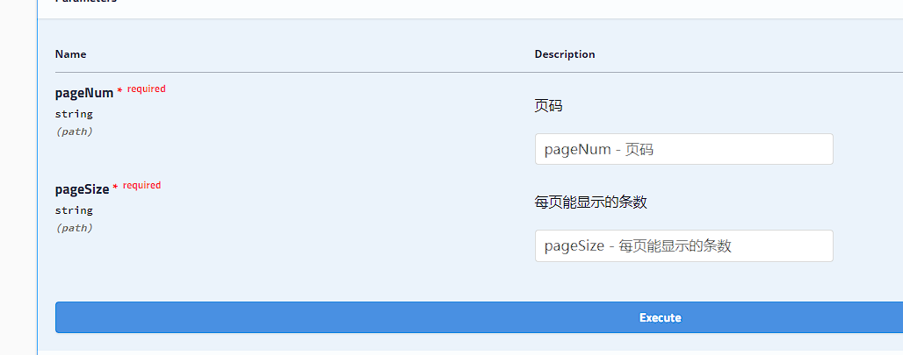
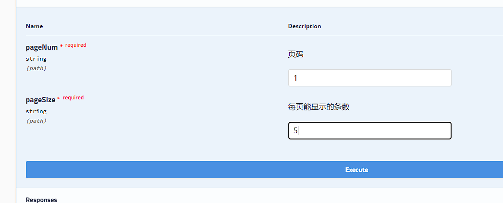

# swagger

## 介绍

相信无论是前端还是后端开发，都或多或少地被接口文档折磨过。前端经常抱怨后端给的接口文档与实际情况不一致。后端又觉得编写及维护接口文档会耗费不少精力，经常来不及更新。其实无论是前端调用后端，还是后端调用后端，都期望有一个好的接口文档。但是这个接口文档对于程序员来说，就跟注释一样，经常会抱怨别人写的代码没有写注释，然而自己写起代码起来，最讨厌的，也是写注释。所以仅仅只通过强制来规范大家是不够的，随着时间推移，版本迭代，接口文档往往很容易就跟不上代码了。

使用Swagger你只需要按照它的规范去定义接口及接口相关的信息。再通过Swagger衍生出来的一系列项目和工具，就可以做到生成各种格式的接口文档，生成多种语言的客户端和服务端的代码，以及在线接口调试页面等等。这样，如果按照新的开发模式，在开发新版本或者迭代版本的时候，只需要更新Swagger描述文件，就可以自动生成接口文档和客户端服务端代码，做到调用端代码、服务端代码以及接口文档的一致性。

为了简化swagger的使用，Spring框架对swagger进行了整合，建立了Spring-swagger项目，后面改成了现在的Springfox。通过在项目中引入Springfox，可以扫描相关的代码，生成描述文件，进而生成与代码一致的接口文档和客户端代码。


Springfox对应的maven坐标如下：

```xml
<dependency>
    <groupId>io.springfox</groupId>
    <artifactId>springfox-swagger-ui</artifactId>
    <version>2.9.2</version>
</dependency>
<dependency>
    <groupId>io.springfox</groupId>
    <artifactId>springfox-swagger2</artifactId>
    <version>2.9.2</version>
</dependency>
```


## swagger常用注解


|        注解        |                           说明                           |
| :----------------: | :------------------------------------------------------: |
|        @Api        |      用在请求的类上，例如Controller，表示对类的说明      |
|     @ApiModel      |    用在类上，通常是实体类，表示一个返回响应数据的信息    |
| @ApiModelProperty  |               用在属性上，描述响应类的属性               |
|   @ApiOperation    |          用在请求的方法上，说明方法的用途、作用          |
| @ApiImplicitParams |            用在请求的方法上，表示一组参数说明            |
| @ApiImplicitParam  | 用在@ApiImplicitParams注解中，指定一个请求参数的各个方面 |


## swagger入门案例


第一步：创建工程swagger_demo


第二步：修改pom文件


```xml
<?xml version="1.0" encoding="UTF-8"?>
<project xmlns="http://maven.apache.org/POM/4.0.0" xmlns:xsi="http://www.w3.org/2001/XMLSchema-instance"
         xsi:schemaLocation="http://maven.apache.org/POM/4.0.0 https://maven.apache.org/xsd/maven-4.0.0.xsd">
    <modelVersion>4.0.0</modelVersion>
    <parent>
        <groupId>org.springframework.boot</groupId>
        <artifactId>spring-boot-starter-parent</artifactId>
        <version>2.7.1</version>
        <relativePath/> <!-- lookup parent from repository -->
    </parent>
    <groupId>mao</groupId>
    <artifactId>swagger_demo</artifactId>
    <version>0.0.1-SNAPSHOT</version>
    <name>swagger_demo</name>
    <description>swagger_demo</description>
    <properties>
        <java.version>11</java.version>
    </properties>
    <dependencies>
        <dependency>
            <groupId>org.springframework.boot</groupId>
            <artifactId>spring-boot-starter-web</artifactId>
        </dependency>

        <dependency>
            <groupId>org.springframework.boot</groupId>
            <artifactId>spring-boot-starter-test</artifactId>
            <scope>test</scope>
        </dependency>

        <dependency>
            <groupId>io.springfox</groupId>
            <artifactId>springfox-swagger-ui</artifactId>
            <version>2.9.2</version>
        </dependency>
        <dependency>
            <groupId>io.springfox</groupId>
            <artifactId>springfox-swagger2</artifactId>
            <version>2.9.2</version>
        </dependency>

    </dependencies>

    <build>
        <plugins>
            <plugin>
                <groupId>org.springframework.boot</groupId>
                <artifactId>spring-boot-maven-plugin</artifactId>
            </plugin>
        </plugins>
    </build>

</project>

```


第三步：创建实体类User


```java
package mao.swagger_demo.entity;

/**
 * Project name(项目名称)：swagger_demo
 * Package(包名): mao.swagger_demo.entity
 * Class(类名): User
 * Author(作者）: mao
 * Author QQ：1296193245
 * GitHub：https://github.com/maomao124/
 * Date(创建日期)： 2022/10/26
 * Time(创建时间)： 20:19
 * Version(版本): 1.0
 * Description(描述)： 无
 */


public class User
{
    /**
     * id
     */
    private long id;

    /**
     * 名字
     */
    private String name;

    /**
     * 密码
     */
    private String password;

}
```


第四步：给实体类User添加对应的注解


```java
package mao.swagger_demo.entity;

import io.swagger.annotations.ApiModel;
import io.swagger.annotations.ApiModelProperty;

/**
 * Project name(项目名称)：swagger_demo
 * Package(包名): mao.swagger_demo.entity
 * Class(类名): User
 * Author(作者）: mao
 * Author QQ：1296193245
 * GitHub：https://github.com/maomao124/
 * Date(创建日期)： 2022/10/26
 * Time(创建时间)： 20:19
 * Version(版本): 1.0
 * Description(描述)： 无
 */

@ApiModel(description = "用户实体类")
public class User
{
    /**
     * id
     */
    @ApiModelProperty(value = "id，主键")
    private long id;

    /**
     * 名字
     */
    @ApiModelProperty(value = "用户的名字或者昵称")
    private String name;

    /**
     * 密码
     */
    @ApiModelProperty(value = "用户的密码")
    private String password;


    public User()
    {
    }

    public User(long id, String name, String password)
    {
        this.id = id;
        this.name = name;
        this.password = password;
    }

    public long getId()
    {
        return id;
    }

    public void setId(long id)
    {
        this.id = id;
    }

    public String getName()
    {
        return name;
    }

    public void setName(String name)
    {
        this.name = name;
    }

    public String getPassword()
    {
        return password;
    }

    public void setPassword(String password)
    {
        this.password = password;
    }

    @Override
    @SuppressWarnings("all")
    public String toString()
    {
        final StringBuilder stringbuilder = new StringBuilder();
        stringbuilder.append("id：").append(id).append('\n');
        stringbuilder.append("name：").append(name).append('\n');
        stringbuilder.append("password：").append(password).append('\n');
        return stringbuilder.toString();
    }
}
```


第五步：创建实体类Menu


```java
package mao.swagger_demo.entity;

/**
 * Project name(项目名称)：swagger_demo
 * Package(包名): mao.swagger_demo.entity
 * Class(类名): Menu
 * Author(作者）: mao
 * Author QQ：1296193245
 * GitHub：https://github.com/maomao124/
 * Date(创建日期)： 2022/10/26
 * Time(创建时间)： 20:34
 * Version(版本): 1.0
 * Description(描述)： 无
 */

public class Menu
{
    /**
     * id
     */
    private long id;

    /**
     * 名字
     */
    private String name;

    /**
     * 类型
     */
    private int type;

    /**
     * 子菜单
     */
    private Menu subMenu;
}
```


第六步：给实体类Menu添加对应的注解


```java
package mao.swagger_demo.entity;

import io.swagger.annotations.ApiModel;
import io.swagger.annotations.ApiModelProperty;

/**
 * Project name(项目名称)：swagger_demo
 * Package(包名): mao.swagger_demo.entity
 * Class(类名): Menu
 * Author(作者）: mao
 * Author QQ：1296193245
 * GitHub：https://github.com/maomao124/
 * Date(创建日期)： 2022/10/26
 * Time(创建时间)： 20:34
 * Version(版本): 1.0
 * Description(描述)： 无
 */

@ApiModel(description = "菜单实体类")
public class Menu
{
    /**
     * id
     */
    @ApiModelProperty(value = "主键")
    private long id;

    /**
     * 名字
     */
    @ApiModelProperty(value = "菜单名称")
    private String name;

    /**
     * 类型
     */
    @ApiModelProperty(value = "菜单的类型，如果为0，则为有子菜单的菜单，如果为1，则为没有子菜单的菜单项")
    private int type;

    /**
     * 子菜单
     */
    @ApiModelProperty(value = "子菜单，如果当前为菜单项，则此字段的值为null")
    private Menu subMenu;

    /**
     * Instantiates a new Menu.
     */
    public Menu()
    {
    }

    /**
     * Instantiates a new Menu.
     *
     * @param id      the id
     * @param name    the name
     * @param type    the type
     * @param subMenu the sub menu
     */
    public Menu(long id, String name, int type, Menu subMenu)
    {
        this.id = id;
        this.name = name;
        this.type = type;
        this.subMenu = subMenu;
    }

    /**
     * Gets id.
     *
     * @return the id
     */
    public long getId()
    {
        return id;
    }

    /**
     * Sets id.
     *
     * @param id the id
     */
    public void setId(long id)
    {
        this.id = id;
    }

    /**
     * Gets name.
     *
     * @return the name
     */
    public String getName()
    {
        return name;
    }

    /**
     * Sets name.
     *
     * @param name the name
     */
    public void setName(String name)
    {
        this.name = name;
    }

    /**
     * Gets type.
     *
     * @return the type
     */
    public int getType()
    {
        return type;
    }

    /**
     * Sets type.
     *
     * @param type the type
     */
    public void setType(int type)
    {
        this.type = type;
    }

    /**
     * Gets sub menu.
     *
     * @return the sub menu
     */
    public Menu getSubMenu()
    {
        return subMenu;
    }

    /**
     * Sets sub menu.
     *
     * @param subMenu the sub menu
     */
    public void setSubMenu(Menu subMenu)
    {
        this.subMenu = subMenu;
    }

    @Override
    @SuppressWarnings("all")
    public String toString()
    {
        final StringBuilder stringbuilder = new StringBuilder();
        stringbuilder.append("id：").append(id).append('\n');
        stringbuilder.append("name：").append(name).append('\n');
        stringbuilder.append("type：").append(type).append('\n');
        stringbuilder.append("subMenu：").append(subMenu).append('\n');
        return stringbuilder.toString();
    }
}
```


第七步：创建实体类Student


```java
package mao.swagger_demo.entity;

/**
 * Project name(项目名称)：swagger_demo
 * Package(包名): mao.swagger_demo.entity
 * Class(类名): Student
 * Author(作者）: mao
 * Author QQ：1296193245
 * GitHub：https://github.com/maomao124/
 * Date(创建日期)： 2022/10/26
 * Time(创建时间)： 20:41
 * Version(版本): 1.0
 * Description(描述)： 无
 */

public class Student
{
    /**
     * id
     */
    private long id;
    /**
     * 名字
     */
    private String name;
    /**
     * 性
     */
    private String sex;
    /**
     * 年龄
     */
    private int age;
}
```


第八步：给实体类Student添加对应的注解


```java
package mao.swagger_demo.entity;

import io.swagger.annotations.ApiModel;
import io.swagger.annotations.ApiModelProperty;

/**
 * Project name(项目名称)：swagger_demo
 * Package(包名): mao.swagger_demo.entity
 * Class(类名): Student
 * Author(作者）: mao
 * Author QQ：1296193245
 * GitHub：https://github.com/maomao124/
 * Date(创建日期)： 2022/10/26
 * Time(创建时间)： 20:41
 * Version(版本): 1.0
 * Description(描述)： 无
 */


@ApiModel(description = "学生实体类")
public class Student
{
    /**
     * id
     */
    @ApiModelProperty(value = "学生的学号，主键")
    private long id;
    /**
     * 名字
     */
    @ApiModelProperty(value = "学生姓名")
    private String name;
    /**
     * 性
     */
    @ApiModelProperty(value = "学生性别")
    private String sex;
    /**
     * 年龄
     */
    @ApiModelProperty(value = "学生的年龄")
    private int age;

    /**
     * Instantiates a new Student.
     */
    public Student()
    {
    }

    /**
     * Instantiates a new Student.
     *
     * @param id   the id
     * @param name the name
     * @param sex  the sex
     * @param age  the age
     */
    public Student(long id, String name, String sex, int age)
    {
        this.id = id;
        this.name = name;
        this.sex = sex;
        this.age = age;
    }

    /**
     * Gets id.
     *
     * @return the id
     */
    public long getId()
    {
        return id;
    }

    /**
     * Sets id.
     *
     * @param id the id
     */
    public void setId(long id)
    {
        this.id = id;
    }

    /**
     * Gets name.
     *
     * @return the name
     */
    public String getName()
    {
        return name;
    }

    /**
     * Sets name.
     *
     * @param name the name
     */
    public void setName(String name)
    {
        this.name = name;
    }

    /**
     * Gets sex.
     *
     * @return the sex
     */
    public String getSex()
    {
        return sex;
    }

    /**
     * Sets sex.
     *
     * @param sex the sex
     */
    public void setSex(String sex)
    {
        this.sex = sex;
    }

    /**
     * Gets age.
     *
     * @return the age
     */
    public int getAge()
    {
        return age;
    }

    /**
     * Sets age.
     *
     * @param age the age
     */
    public void setAge(int age)
    {
        this.age = age;
    }

    @Override
    @SuppressWarnings("all")
    public String toString()
    {
        final StringBuilder stringbuilder = new StringBuilder();
        stringbuilder.append("id：").append(id).append('\n');
        stringbuilder.append("name：").append(name).append('\n');
        stringbuilder.append("sex：").append(sex).append('\n');
        stringbuilder.append("age：").append(age).append('\n');
        return stringbuilder.toString();
    }
}
```


第九步：创建UserController


```java
package mao.swagger_demo.controller;

import mao.swagger_demo.entity.User;
import org.springframework.web.bind.annotation.*;

import java.util.ArrayList;
import java.util.List;

/**
 * Project name(项目名称)：swagger_demo
 * Package(包名): mao.swagger_demo.controller
 * Class(类名): UserController
 * Author(作者）: mao
 * Author QQ：1296193245
 * GitHub：https://github.com/maomao124/
 * Date(创建日期)： 2022/10/26
 * Time(创建时间)： 20:45
 * Version(版本): 1.0
 * Description(描述)： 无
 */

@RestController
@RequestMapping("/user")
public class UserController
{
    @GetMapping("/{id}")
    public User getUser(@PathVariable long id)
    {
        return new User(id, "张三", "1234");
    }

    @GetMapping
    public List<User> getAll()
    {
        List<User> list = new ArrayList<>(3);
        list.add(new User(1, "张三", "1234"));
        list.add(new User(2, "张三", "1234"));
        list.add(new User(3, "张三", "1234"));
        return list;
    }

    @PostMapping("")
    public String saveUser()
    {
        return "ok";
    }

    @PutMapping
    public String updateUser()
    {
        return "ok";
    }

    @DeleteMapping
    public String deleteUser()
    {
        return "ok";
    }
}
```


第十步：给UserController添加对应的注解


```java
package mao.swagger_demo.controller;

import io.swagger.annotations.Api;
import io.swagger.annotations.ApiImplicitParam;
import io.swagger.annotations.ApiImplicitParams;
import io.swagger.annotations.ApiOperation;
import mao.swagger_demo.entity.User;
import org.springframework.web.bind.annotation.*;

import java.util.ArrayList;
import java.util.List;

/**
 * Project name(项目名称)：swagger_demo
 * Package(包名): mao.swagger_demo.controller
 * Class(类名): UserController
 * Author(作者）: mao
 * Author QQ：1296193245
 * GitHub：https://github.com/maomao124/
 * Date(创建日期)： 2022/10/26
 * Time(创建时间)： 20:45
 * Version(版本): 1.0
 * Description(描述)： 无
 */

@Api(tags = "用户控制器")
@RestController
@RequestMapping("/user")
public class UserController
{
    @GetMapping("/{id}")
    @ApiOperation(value = "根据用户id查询用户", notes = "根据用户id查询用户")
    @ApiImplicitParams
            (
                    @ApiImplicitParam(name = "id", value = "用户的id", required = true, type = "long")
            )
    public User getUser(@PathVariable long id)
    {
        return new User(id, "张三", "1234");
    }

    @GetMapping
    @ApiOperation(value = "查询所有用户", notes = "查询所有用户的信息")
    public List<User> getAll()
    {
        List<User> list = new ArrayList<>(3);
        list.add(new User(1, "张三", "1234"));
        list.add(new User(2, "张三", "1234"));
        list.add(new User(3, "张三", "1234"));
        return list;
    }

    @PostMapping("")
    @ApiOperation(value = "保存(添加)用户的信息", notes = "保存(添加)用户的信息")
    public String saveUser()
    {
        return "ok";
    }

    @PutMapping
    @ApiOperation(value = "更新用户信息", notes = "更新用户信息")
    public String updateUser()
    {
        return "ok";
    }

    @DeleteMapping
    @ApiOperation(value = "删除用户的信息", notes = "删除用户的信息")
    public String deleteUser()
    {
        return "ok";
    }
}
```


第十一步：创建MenuController


```java
package mao.swagger_demo.controller;

import org.springframework.web.bind.annotation.*;

/**
 * Project name(项目名称)：swagger_demo
 * Package(包名): mao.swagger_demo.controller
 * Class(类名): MenuController
 * Author(作者）: mao
 * Author QQ：1296193245
 * GitHub：https://github.com/maomao124/
 * Date(创建日期)： 2022/10/26
 * Time(创建时间)： 21:02
 * Version(版本): 1.0
 * Description(描述)： 无
 */


public class MenuController
{
    @PostMapping("/save")
    public String save()
    {
        return "OK";
    }

    @PutMapping("/update")
    public String update()
    {
        return "OK";
    }

    @DeleteMapping("/delete")
    public String delete(int id)
    {
        return "OK";
    }


    @GetMapping(value = "page/{pageNum}/{pageSize}")
    public List<Menu> findByPage(@PathVariable Integer pageNum,
                             @PathVariable Integer pageSize)
    {
        return null;
    }
}
```


第十二步：给MenuController添加相应的注解


```java
package mao.swagger_demo.controller;

import io.swagger.annotations.Api;
import io.swagger.annotations.ApiImplicitParam;
import io.swagger.annotations.ApiImplicitParams;
import io.swagger.annotations.ApiOperation;
import org.springframework.web.bind.annotation.*;

/**
 * Project name(项目名称)：swagger_demo
 * Package(包名): mao.swagger_demo.controller
 * Class(类名): MenuController
 * Author(作者）: mao
 * Author QQ：1296193245
 * GitHub：https://github.com/maomao124/
 * Date(创建日期)： 2022/10/26
 * Time(创建时间)： 21:02
 * Version(版本): 1.0
 * Description(描述)： 无
 */


@RestController()
@RequestMapping("/menu")
@Api(tags = "菜单控制器")
public class MenuController
{
    @PostMapping("/save")
    @ApiOperation(value = "添加菜单", notes = "添加菜单")
    public String save()
    {
        return "OK";
    }

    @PutMapping("/update")
    @ApiOperation(value = "更新菜单", notes = "更新菜单")
    public String update()
    {
        return "OK";
    }

    @DeleteMapping("/delete")
    @ApiOperation(value = "删除菜单", notes = "删除菜单")
    @ApiImplicitParams
            (
                    @ApiImplicitParam(name = "id", value = "菜单的id", required = true, type = "long")
            )
    public String delete(long id)
    {
        return "OK";
    }


    @GetMapping(value = "page/{pageNum}/{pageSize}")
    @ApiOperation(value = "分页查询", notes = "分页查询菜单信息")
    @ApiImplicitParams
            (
                    {
                            @ApiImplicitParam(name = "pageNum", value = "页码", required = true, type = "Integer"),
                            @ApiImplicitParam(name = "pageSize", value = "每页能显示的条数", required = true, type = "Integer")
                    }
            )
    public List<Menu> findByPage(@PathVariable Integer pageNum,
                             @PathVariable Integer pageSize)
    {
        return null;
    }
}

```


第十三步：创建StudentController


```java
package mao.swagger_demo.controller;

import org.springframework.web.bind.annotation.GetMapping;
import org.springframework.web.bind.annotation.PathVariable;
import org.springframework.web.bind.annotation.RequestMapping;
import org.springframework.web.bind.annotation.RestController;

/**
 * Project name(项目名称)：swagger_demo
 * Package(包名): mao.swagger_demo.controller
 * Class(类名): StudentController
 * Author(作者）: mao
 * Author QQ：1296193245
 * GitHub：https://github.com/maomao124/
 * Date(创建日期)： 2022/10/26
 * Time(创建时间)： 21:12
 * Version(版本): 1.0
 * Description(描述)： 无
 */

@RestController
@RequestMapping("/student")
public class StudentController
{
    @GetMapping("/{pageNum}/{pageSize}")
    public List<Student> findByPage(@PathVariable Integer pageNum,
                             @PathVariable Integer pageSize)
    {
        return null;
    }
}
```


第十四步：给StudentController添加相应的注解


```java
package mao.swagger_demo.controller;

import io.swagger.annotations.Api;
import io.swagger.annotations.ApiImplicitParam;
import io.swagger.annotations.ApiImplicitParams;
import io.swagger.annotations.ApiOperation;
import org.springframework.web.bind.annotation.GetMapping;
import org.springframework.web.bind.annotation.PathVariable;
import org.springframework.web.bind.annotation.RequestMapping;
import org.springframework.web.bind.annotation.RestController;

/**
 * Project name(项目名称)：swagger_demo
 * Package(包名): mao.swagger_demo.controller
 * Class(类名): StudentController
 * Author(作者）: mao
 * Author QQ：1296193245
 * GitHub：https://github.com/maomao124/
 * Date(创建日期)： 2022/10/26
 * Time(创建时间)： 21:12
 * Version(版本): 1.0
 * Description(描述)： 无
 */

@RestController
@RequestMapping("/student")
@Api(tags = "学生控制器")
public class StudentController
{
    @GetMapping("/{pageNum}/{pageSize}")
    @ApiOperation(value = "分页查询学生的信息", notes = "分页查询学生的信息")
    @ApiImplicitParams
            (
                    {
                            @ApiImplicitParam(name = "pageNum", value = "页码", required = true, type = "Integer"),
                            @ApiImplicitParam(name = "pageSize", value = "每页能显示的条数", required = true, type = "Integer")
                    }
            )
    public List<Student> findByPage(@PathVariable Integer pageNum,
                             @PathVariable Integer pageSize)
    {
        return null;
    }
}
```


第十五步：添加配置类SwaggerConfig


```java
package mao.swagger_demo.config;


import org.springframework.context.annotation.Bean;
import org.springframework.context.annotation.Configuration;

import springfox.documentation.builders.ApiInfoBuilder;
import springfox.documentation.builders.RequestHandlerSelectors;
import springfox.documentation.service.ApiInfo;
import springfox.documentation.service.Contact;
import springfox.documentation.spi.DocumentationType;
import springfox.documentation.spring.web.plugins.Docket;

import springfox.documentation.swagger2.annotations.EnableSwagger2;


/**
 * Project name(项目名称)：swagger_demo
 * Package(包名): mao.swagger_demo.config
 * Class(类名): SwaggerConfig
 * Author(作者）: mao
 * Author QQ：1296193245
 * GitHub：https://github.com/maomao124/
 * Date(创建日期)： 2022/10/26
 * Time(创建时间)： 21:19
 * Version(版本): 1.0
 * Description(描述)： 无
 */

@Configuration
@EnableSwagger2
public class SwaggerConfig
{
    private ApiInfo apiInfo()
    {
        return new ApiInfoBuilder()
                .title("API接口文档")
                .contact(new Contact("mao", "https://github.com/maomao124/", "1234@qq.com"))
                .version("1.0")
                .description("描述")
                .build();
    }

    @Bean
    public Docket docket()
    {
        Docket docket = new Docket(DocumentationType.SWAGGER_2)
                .apiInfo(apiInfo())
                .groupName("默认组")
                .select()
                .apis(RequestHandlerSelectors.basePackage("mao.swagger_demo"))
                .build();
        return docket;
    }
}

```


第十六步：更改配置文件


```yaml
spring:
  mvc:
    pathmatch:
      matching-strategy: ant_path_matcher
```


第十七步：启动程序


```sh

  .   ____          _            __ _ _
 /\\ / ___'_ __ _ _(_)_ __  __ _ \ \ \ \
( ( )\___ | '_ | '_| | '_ \/ _` | \ \ \ \
 \\/  ___)| |_)| | | | | || (_| |  ) ) ) )
  '  |____| .__|_| |_|_| |_\__, | / / / /
 =========|_|==============|___/=/_/_/_/
 :: Spring Boot ::                (v2.7.1)

2022-10-27 12:43:12.425  INFO 15432 --- [           main] mao.swagger_demo.SwaggerDemoApplication  : Starting SwaggerDemoApplication using Java 16.0.2 on mao with PID 15432 (H:\程序\大四上期\swagger_demo\target\classes started by mao in H:\程序\大四上期\swagger_demo)
2022-10-27 12:43:12.427  INFO 15432 --- [           main] mao.swagger_demo.SwaggerDemoApplication  : No active profile set, falling back to 1 default profile: "default"
2022-10-27 12:43:13.257  INFO 15432 --- [           main] o.s.b.w.embedded.tomcat.TomcatWebServer  : Tomcat initialized with port(s): 8080 (http)
2022-10-27 12:43:13.264  INFO 15432 --- [           main] o.apache.catalina.core.StandardService   : Starting service [Tomcat]
2022-10-27 12:43:13.265  INFO 15432 --- [           main] org.apache.catalina.core.StandardEngine  : Starting Servlet engine: [Apache Tomcat/9.0.64]
2022-10-27 12:43:13.350  INFO 15432 --- [           main] o.a.c.c.C.[Tomcat].[localhost].[/]       : Initializing Spring embedded WebApplicationContext
2022-10-27 12:43:13.350  INFO 15432 --- [           main] w.s.c.ServletWebServerApplicationContext : Root WebApplicationContext: initialization completed in 883 ms
2022-10-27 12:43:13.604  INFO 15432 --- [           main] pertySourcedRequestMappingHandlerMapping : Mapped URL path [/v2/api-docs] onto method [springfox.documentation.swagger2.web.Swagger2Controller#getDocumentation(String, HttpServletRequest)]
2022-10-27 12:43:13.753  INFO 15432 --- [           main] o.s.b.w.embedded.tomcat.TomcatWebServer  : Tomcat started on port(s): 8080 (http) with context path ''
2022-10-27 12:43:13.754  INFO 15432 --- [           main] d.s.w.p.DocumentationPluginsBootstrapper : Context refreshed
2022-10-27 12:43:13.765  INFO 15432 --- [           main] d.s.w.p.DocumentationPluginsBootstrapper : Found 1 custom documentation plugin(s)
2022-10-27 12:43:13.786  INFO 15432 --- [           main] s.d.s.w.s.ApiListingReferenceScanner     : Scanning for api listing references
2022-10-27 12:43:13.882  INFO 15432 --- [           main] .d.s.w.r.o.CachingOperationNameGenerator : Generating unique operation named: findByPageUsingGET_1
2022-10-27 12:43:13.914  INFO 15432 --- [           main] mao.swagger_demo.SwaggerDemoApplication  : Started SwaggerDemoApplication in 1.787 seconds (JVM running for 2.316)
```


第十八步：访问


http://localhost:8080/swagger-ui.html








## knife4j介绍


